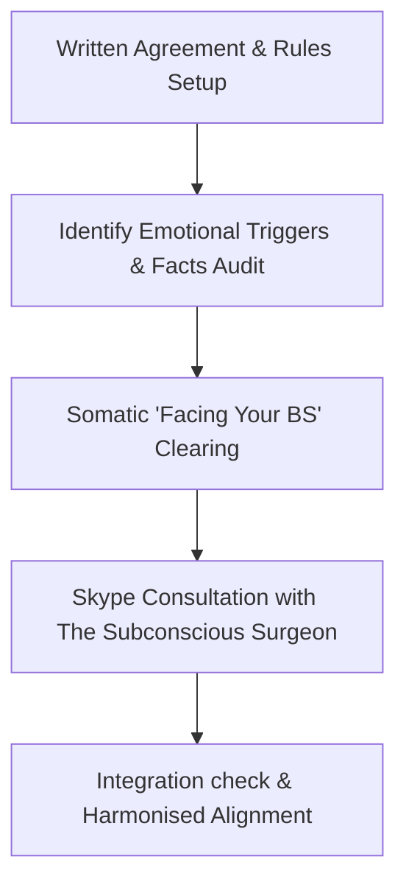

# The Couples Harmonisation Method (2015-2017)

## Executive Summary & Historical Lineage
The **Couples Harmonisation Method** represents a critical developmental bridge in Adrian Taffinder's lineage, serving as the evolutionary precursor to the formalized **Subconscious Surgery (SS)** and **Bodhisvara** voice-analytics paradigms. 

Developed between 2015 and 2017, the method was conceptualized as a highly structured, organic, and interactive online training curriculum combined with 1-on-1 diagnostic Skype consultations. Its primary commercial package was a 1-year online subscription priced at £295, supported by a JustGiving crowdfunding campaign aimed at gifting the program to 5,000 couples worldwide whose relationships were impacted by depression and anxiety. It focused strictly on universal human behavior, intentionally bypassing cultural, religious, and gender-stereotyped frameworks.

---

## 1. Core Philosophical Foundations
The Couples Harmonisation Method is built upon three non-negotiable relationship principles:

1. **Equality of Perspective:**
   > *"At the end of the day, a relationship is all about equality. Both of your opinions should matter. All opinions do matter. The Challenge is communicating that, and allowing each other the space to be able to understand it."*
2. **De-escalation of the Reactionary Ego:**
   The training focuses on safely exposing the root causes of relationship friction. It demands that participants drop defensive posturing:
   > *"This online Couple’s Harmonisation programme gives you the ability to prove yourself right, and prove the other person wrong, but by the same token, you have to be open and willing to be wrong yourself... you’ve really got to be able to face your own BS, and have a really good laugh about it too."*
3. **Ego-Free Altruism:**
   Adrian emphasizes that prioritizing one's own desires over the partner's is a structural relationship failure:
   > *"If you think your needs are more important than your partner’s, well then you’re in the wrong relationship. In fact, you probably shouldn’t be in a relationship."*

---

## 2. The Structured Rules of Engagement (The Agreement)
The single most critical element of the Couples Harmonisation Method is the **written and verbal agreement** established at the start of the process. This structural firewall prevents emotional runaway during dispute resolution.

- **The Primary Danger (Emotion):**
  > *"This is to protect both of you from a situation that could spiral out of control, because the biggest killer in any dispute resolution is emotion. Anger and frustration, annoyance and bitterness, are all feelings we need to address right from the offset."*
- **The Preventive Protocol:**
  For the first half of the entire program, the couple is guided step-by-step through the rules agreement. By spelling out emotional triggers in advance, the couple is inoculated against reactive fights:
  > *"By primarily spelling out to you what could possibly happen during the process, when and if it does happen, you will be fully equipped to know what to do, so that you don't loose control whilst you are resolving your issues."*
- **The Intentional Foundation:**
  > *"I do feel that the agreement is probably the single most important thing about the whole exercise, because if you don't go into this exercise with the right intention from the beginning, then it will all go downhill from there."*

---

## 3. Methodological Mechanics & Integration Checklists
The process alternates between automated modular lessons and intensive diagnostic checkpoints:

### Actionable Cleansing Framework:
- **Rules Inoculation:** Establish rigid guidelines regarding speaking turns, banned reactionary words, and emotional timeouts.
- **Fact-Only Auditing:** Strip disputes of emotional labels and locate the raw, verifiable facts behind partner grievances.
- **Somatic Space Injection:** Intentionally schedule physical/mental "space to grow," bypassing defensive loops by allowing energy channels to settle before attempting resolution.
- **The Laughter Integration:** Reframe historical arguments through playful self-mockery, breaking the cognitive pattern-lock of victimhood.

---

## 4. Lineage Evolution: From Harmonisation to Subconscious Surgery
Comparing the 2015-2017 Couples Harmonisation Method with the later Subconscious Surgery stack shows the exact path of Adrian's technical evolution:

| Axis | Couples Harmonisation (2015-2017) | Subconscious Surgery (2017-Present) |
| :--- | :--- | :--- |
| **Target Dynamic** | Interpersonal relationship systems and conflict resolution. | Deep individual subconscious patterns and physical somatic clearing. |
| **Core Technique** | Structured rules agreements, factual dispute resolution, perspective alignment. | Age-regression muscle testing, electrical block clearance scripts. |
| **Delivery Model** | Crowdfunded online subscriptions (£295/yr), Skype video consultations. | High-tier 1:1 masterminds, in-person deep retreats, physical training. |
| **Systemic Focus** | Human behavior, emotional de-escalation, mutual accountability. | Bioreprogramming, neuroscience, ancestral line somatic releases. |

---

## 5. Grounding Attestation & Audit Trail
All concepts, quotes, and structural elements detailed in this synthesis are transcribed verbatim from grounded archival recordings and handover files (primarily Helen Nachintu's SS Handover documents, 2017). No concepts have been simulated or embellished.
