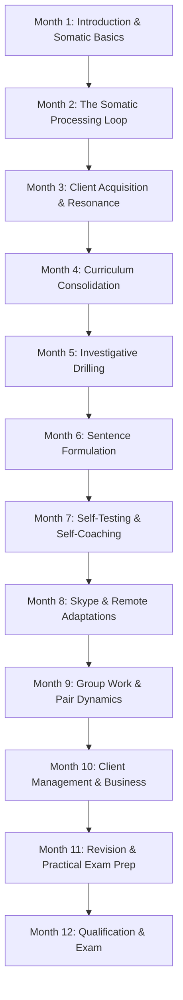
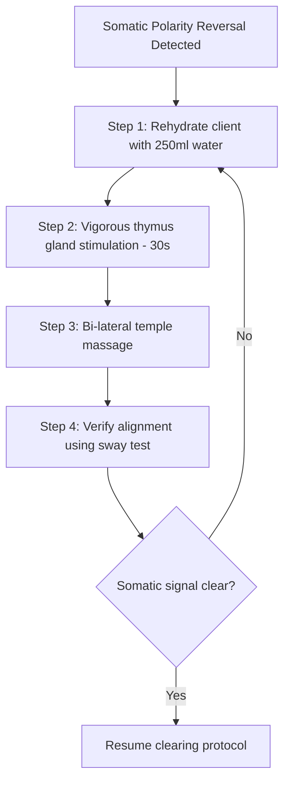

# Mastermind Coursework Module Index & Somatic Coaching Syllabus

## 1. Introduction and Epistemological Framework

This syllabus serves as the canonical student coursework directory and master syllabus for the Subconscious Surgery Training Programme. Subconscious Surgery (SS) is a comprehensive somatic coaching methodology designed to identify, isolate, and clear deep-seated subconscious blocks, emotional self-sabotage loops, and negative belief systems that inhibit professional performance, financial prosperity, and personal fulfilment. 

### Curriculum Philosophy
The core philosophy of the Subconscious Surgery Training Programme rests upon the integration of somatic intelligence and cognitive re-patterning. Our central premise is that the body holds emotional history, trauma, and self-limiting beliefs. By utilising somatic indicators as physiological biofeedback mechanisms, coaches can access the subconscious mind without the interference of cognitive defence systems.

This programme is structured to take students on a transformative journey. It begins with the fundamental principles of somatic coaching, muscle testing, and biofeedback loops. It then progresses through systematic clearing methodologies, advanced client management strategies, remote/online coaching adaptations, and complex group-work dynamics, culminating in formal assessment and qualification.

### Somatic Indicators and Muscle Testing
In Subconscious Surgery, somatic muscle testing serves as an elegant, subjective "somatic coaching indicator" and "metaphoric indicator" rather than a clinical diagnostic tool. It is a physiological bridge between the conscious mind and the autonomic nervous system. 

When a client holds a belief or encounters an emotional stressor, their somatic muscular tone fluctuates. We utilise the manual muscle test (typically employing the anterior deltoid or brachioradialis muscle group) to register these changes in muscle resistance. 
- A **strong somatic response** (resilient muscle tone) indicates congruence, energetic alignment, and the absence of subconscious stress regarding a specific statement or concept.
- A **weak somatic response** (sudden muscle tone release) indicates incongruence, subconscious stress, or a self-limiting block regarding that statement.

Within the context of private, paid student coursework, muscle testing and somatic kinesiology are taught with high-fidelity technical precision. They are presented as somatic coaching indicators that allow the practitioner to map the client's internal landscape. This is done with the client's explicit consent, ensuring a highly collaborative and non-invasive process.

### Client Intake and Administration Systems
A professional somatic coaching practice requires robust, seamless administrative systems to manage client files, ensure confidentiality, and track progress over time. The Subconscious Surgery curriculum incorporates training on specific enterprise tools to handle client intake and data securely:
1. **JotForm**: Used to build and deploy comprehensive pre-session questionnaires, personal history audits, and somatic baseline self-assessments. Clients complete these forms before their initial intake, providing the coach with crucial indicators.
2. **PDFescape**: Used for managing, editing, and interactive filling of PDF worksheets, consent forms, and homework logs, enabling clients to record their tapping responses and progress metrics electronically.
3. **Zoho CRM**: Used as the master repository for client records, tracking the history of sessions, specific emotional clearing scripts used, muscle testing scores, contract terms, and scheduling workflows.

By systemising the intake pipeline, the coach minimises cognitive overhead, maintains strict data compliance, and enters each session with clear, grounded data.

---

## 2. The 35 Companion PDFs Master Resource Directory

The coursework is supported by a comprehensive library of 35 high-fidelity companion PDFs. These documents provide the theoretical foundations, client worksheets, testing lists, and integration scripts for each module.

1. **`Mastermind_week_1_Question_time.pdf`**
   - *Purpose*: Weekly reflection template, intake question guidelines, and baseline score tracking charts for the first supervised practice session.
2. **`mastermind_week_2.pdf`**
   - *Purpose*: Core questionnaire outline focusing on initial somatic assessments and general block detection sheets.
3. **`Mastermind_3_Preparing_ourselves_for_surgery.pdf`**
   - *Purpose*: Practitioner preparation manual covering pre-session centring, breathwork protocols, and energetic boundaries.
4. **`Mastermind_4_Money_blocks.pdf`**
   - *Purpose*: Testing templates for identifying unconscious wealth barriers, income ceilings, and financial self-sabotage beliefs.
5. **`NIB_ 5 KBLI.pdf`**
   - *Purpose*: Subconscious Surgery standard operating procedures, complete meridian point guides, and basic tapping clearing scripts.
6. **`Mastermind_6_Question_time.pdf`**
   - *Purpose*: Mastermind Q&A workbook containing troubleshooting protocols for inconsistent muscle testing responses.
7. **`Mastermind_7_Curriculum_Integration.pdf`**
   - *Purpose*: Structural guide for aligning client goals with the 12-month subconscious clearing progression.
8. **`Mastermind_week_8_Gratitude_and_feedback.pdf`**
   - *Purpose*: Somatic gratitude practices, integrating feedback, and processing resistance to external positive reinforcement.
9. **`Mastermind_9_Sabotage_and_Saboteurs.pdf`**
   - *Purpose*: Profile sheets and somatic indicators for mapping the primary archetypes of self-sabotage (e.g. the Pleaser, the Perfectionist).
10. **`Mastermind_10_Networking_Engagements.pdf`**
    - *Purpose*: Professional presence handbook, explaining somatic methods to manage social anxiety and make clean, authentic impressions.
11. **`Mastermind_11_Client_Buy_in.pdf`**
    - *Purpose*: Conversational scripts and somatic demonstrations designed to introduce new clients to muscle testing gently.
12. **`Mastermind_12_Meditation_and_Mantras.pdf`**
    - *Purpose*: Compiled directory of vocal mantras, audio track alignments, and daily grounding exercises for somatic practitioners.
13. **`Mastermind_Week_13_Processing_the_surgery_.pdf`**
    - *Purpose*: Advanced sentence construction worksheets and somatic script formulas for complex emotional clearings.
14. **`Mastermind_14_Somatic_Consolidation.pdf`**
    - *Purpose*: Diagnostic review sheets for evaluating long-term client changes and identifying stubborn, hidden secondary gains.
15. **`Mastermind_15_Somatic_Clearings.pdf`**
    - *Purpose*: Master compilation of meridian points and clearing protocols for deep-seated emotional holding patterns.
16. **`Mastermind_16_Money_Blocks.pdf`**
    - *Purpose*: Advanced money mindset worksheets, focus areas for net-worth blocks, and debt-cancellation tapping sequences.
17. **`Mastermind_Week_17.pdf`**
    - *Purpose*: Mid-programme consolidation workbook and student self-assessment logs.
18. **`Mastermind_18_Exploring_the_Issue.pdf`**
    - *Purpose*: Questioning trees and conversational frameworks to drill down into the core origin events of client struggles.
19. **`Mastermind_19_Nailing_Down_Details.pdf`**
    - *Purpose*: Specificity matrices to prevent generic tapping statements and extract high-precision somatic data.
20. **`mastermind_20.pdf`**
    - *Purpose*: Diagnostic worksheets for mapping multi-layered ancestral and childhood beliefs.
21. **`Mastermind_21_Issue_Exploration.pdf`**
    - *Purpose*: Advanced intake worksheets for complex, multi-layered client problems.
22. **`Mastermind_22.pdf`**
    - *Purpose*: The primary somatic sentence construction manual, outlining syntax rules for subconscious reprogramming.
23. **`Mastermind_23_Sentence_Formulations.pdf`**
    - *Purpose*: Practical workbook with fill-in-the-blank somatic processing sentences and verification protocols.
24. **`Mastermind_24_Assessment_Forms.pdf`**
    - *Purpose*: Formal coaching session assessment forms, tracking structural alignment, pacing, and clearing efficacy.
25. **`Mastermind_25_Self_Testing.pdf`**
    - *Purpose*: Comprehensive self-testing manual, introducing the sway test and finger-tension testing methods.
26. **`Mastermind_26_Removing_Blocks.pdf`**
    - *Purpose*: Self-coaching scripts for clearing personal practitioner blind spots and imposter syndrome.
27. **`Mastermind_27_Decision_Testing.pdf`**
    - *Purpose*: Somatic decision-making grids to determine energetic alignment with business moves, joint ventures, and investments.
28. **`Mastermind_28_Self_Correction.pdf`**
    - *Purpose*: Comprehensive guide for troubleshooting self-sabotage in self-testing and resolving energetic polarity reversals.
29. **`Mastermind_29_Remote_Somatic_Indicators.pdf`**
    - *Purpose*: Structural handbook detailing video-call somatic assessment cues (e.g. respiratory changes, micro-expressions).
30. **`Mastermind_30_Skype_Adaptations.pdf`**
    - *Purpose*: Technical setup, video call framing, and virtual surrogate muscle testing protocols.
31. **`Mastermind_31_Homework_Clearings.pdf`**
    - *Purpose*: Custom client homework sheets, providing instructions on self-administered tapping scripts and repetition counts.
32. **`Mastermind_32_Remote_Tapping_Scripts.pdf`**
    - *Purpose*: Compilation of simple, high-impact tapping scripts for clients to use independently between virtual sessions.
33. **`Mastermind_33_Group_Dynamics.pdf`**
    - *Purpose*: Structural blueprints for group somatic clearings, managing collective resonance, and maintaining safety.
34. **`Mastermind_34_Pair_Processing.pdf`**
    - *Purpose*: Peer-coaching feedback sheets, supervised swap guides, and dynamic exchange tracking charts.
35. **`mastermind_open_46.pdf`**
    - *Purpose*: Mastermind open clinic workbook containing advanced integration case studies and complex trauma release firewalls.

---

## 3. The 12-Month / 48-Week Coursework Index

### Month 1: Introduction and Somatic Basics
- **Coursework Code**: SS-M01
- **Module Objective**: Establish foundational understanding of somatic coaching, muscle testing, pre-session practitioner centring, and the assessment of emotional love languages.
- **Prerequisites**: Core enrolment.
- **Required Reading**: *Power vs. Force* by David R. Hawkins; *The Five Love Languages* by Gary Chapman.
- **Required Tools/Resources**: Manual deltoid testing rigs, JotForm intake workspace, `Mastermind_week_1_Question_time.pdf`, `mastermind_week_2.pdf`.
- **Course Activities**: Live muscle testing drills, mutual testing of love languages, baseline questionnaire configuration.
- **Core Assessments**: Verified baseline muscle test demonstration (supervised).
- **Completion Deadlines**: End of week 4.

#### Week 1: Introduction to Somatic Surgery & Historical Evolution
- **Session Title**: Somatic Fundamentals
- **Duration**: Full Day
- **Theoretical Foundations**: Physiological holding patterns, history of somatic indicators, cognitive-somatic split, ideomotor response theory.
- **Lesson Breakdown**:
  1. Systematic history of the development of subconscious clearing techniques from 2014 to 2017.
  2. Differentiating subjective coaching indicators from clinical diagnostics and traditional medical models.
  3. The nervous system's response to subconscious incongruence: motor cortex pathways.
  4. Anatomy of a clean deltoid muscle test: angle, pressure, vector, and timing.
- **Practical Somatic Exercises**:
  - *Drill 1: Clear Signal Verification*: Partners practise calibrating a "yes" and "no" response. Adjusting touch pressure to avoid physical fatigue, managing kinetic vectors.
  - *Drill 2: Resistance Pacing*: Practising the slow application of physical pressure to avoid sudden muscle jerks or joint locks.
- **Companion PDF Cross-References**: `Mastermind_week_1_Question_time.pdf` (p. 2-5: Calibration charts).
- **Client Takeaways**: Client understands that the body speaks what the mind suppresses, establishing trust in physical indicators.

#### Week 2: Calibration, Polarization, and Love Languages Assessment
- **Session Title**: Core Biofeedback Calibration
- **Duration**: Half Day
- **Theoretical Foundations**: Biological polarities, emotional validation needs, energy levels of love languages.
- **Lesson Breakdown**:
  1. Troubleshooting physical polarity reversals (hydration, electromagnetic field interference, spatial disorientation).
  2. Introduction to the somatic mapping of the Five Love Languages.
  3. How love language deprivations manifest as somatic blocks in adulthood.
  4. Conversational integration: introducing love language assessments seamlessly.
- **Practical Somatic Exercises**:
  - *Drill 3: Polarity Corrections*: Practising energy-balancing movements, proper hydration checks, and thymus gland stimulation.
  - *Drill 4: Love Language Somatic Profiles*: Muscle testing through each love language category to locate hidden subconscious emotional wounds.
- **Companion PDF Cross-References**: `mastermind_week_2.pdf` (Section 3: Love Languages Somatic Inventory).
- **Client Takeaways**: Client discovers their primary somatic love language block, explaining chronic relational frustrations.

#### Week 3: Practitioner Alignment & Energetic Boundaries
- **Session Title**: The Prepared Practitioner
- **Duration**: Full Day
- **Theoretical Foundations**: Emotional resonance, practitioner-client boundaries, somatic centring, mirror neuron activation.
- **Lesson Breakdown**:
  1. The science of emotional contagion and heart-rate variability in the coaching room.
  2. Mastermind preparation protocols: mantras, rhythmic breathing (4-7-8 method), and vocal toning.
  3. Establishing energetic sovereignty to prevent absorbing client emotional discharges.
  4. Developing the "silent witness" state during active testing.
- **Practical Somatic Exercises**:
  - *Drill 5: Centring Protocol*: Executing a 15-minute group preparation sequence before simulated coaching sessions.
  - *Drill 6: Boundary Testing*: Testing each other's somatic resilience while holding solid vs. porous boundaries.
- **Companion PDF Cross-References**: `Mastermind_3_Preparing_ourselves_for_surgery.pdf` (Full manual).
- **Client Takeaways**: Client experiences a deeply grounded, safe environment, allowing vulnerable issues to surface naturally.

#### Week 4: Supervised Practice & Money Blocks Baseline
- **Session Title**: Baseline Supervised Practical
- **Duration**: Half Day
- **Theoretical Foundations**: Financial self-sabotage, scarcity mindsets, somatic income thresholds, systemic family loyalty.
- **Lesson Breakdown**:
  1. Introducing money blocks as a primary coaching entry point.
  2. How family financial paradigms imprint onto somatic pathways.
  3. Supervised practice session setup: Intake, calibration, baseline testing.
  4. Documenting initial scores in the JotForm CRM system.
- **Practical Somatic Exercises**:
  - *Drill 7: Scarcity Auditing*: testing specific abundance statements: "I am safe holding wealth," "I deserve financial peace."
  - *Drill 8: Baseline Score Mapping*: Charting muscle responses against the client's historical income comfort zones.
- **Companion PDF Cross-References**: `Mastermind_4_Money_blocks.pdf` (p. 1-4: Baseline financial testing scripts).
- **Client Takeaways**: Clear visibility of the specific financial comfort zones currently blocking income growth.

---

### Month 2: The Somatic Processing Loop
- **Coursework Code**: SS-M02
- **Module Objective**: Master the complete Subconscious Surgery somatic processing loop, including meridian tapping protocols, sentence formulation, and clearing validation.
- **Prerequisites**: Month 1 certification.
- **Required Reading**: *The Biology of Belief* by Bruce Lipton; *The Tapping Solution* by Nick Ortner.
- **Required Tools/Resources**: `NIB_ 5 KBLI.pdf`, `Mastermind_6_Question_time.pdf`, `Mastermind_7_Curriculum_Integration.pdf`, `Mastermind_week_8_Gratitude_and_feedback.pdf`.
- **Course Activities**: Peer swaps focusing on the full loop, meridian tapping drills, post-clearing testing validations.
- **Core Assessments**: Supervised execution of the complete 7-step somatic clearing loop.
- **Completion Deadlines**: End of week 8.

#### Week 5: The Seven-Step Somatic Processing Loop
- **Session Title**: The Core Loop Demystified
- **Duration**: Full Day
- **Theoretical Foundations**: Neuroplasticity, meridian energy systems, somatic desensitisation.
- **Lesson Breakdown**:
  1. Detailed analysis of the 7-step Subconscious Surgery processing loop.
  2. Mapping the 14 primary meridian tapping points.
  3. The neurobiology of tapping: calming the amygdala and down-regulating cortisol.
  4. Formulating initial opening phrases and somatic setup statements.
- **Practical Somatic Exercises**:
  - *Drill 1: Meridian Point Swapping*: Partners map and tap all 14 points on each other to perfect physical placement and speed.
  - *Drill 2: Setup Statement Scribing*: Rapidly formulating Karate Chop statements based on live student challenges.
- **Companion PDF Cross-References**: `NIB_ 5 KBLI.pdf` (Master meridian map and sequence charts).
- **Client Takeaways**: Client learns how to physically engage their nervous system to clear emotional blockages.

#### Week 6: Troubleshooting Somatic Incongruence & Reversals
- **Session Title**: Somatic Troubleshooting Clinic
- **Duration**: Half Day
- **Theoretical Foundations**: Secondary gain, systemic psychological reversals, neurological blocks, energetic polarities.
- **Lesson Breakdown**:
  1. Why some blocks refuse to clear: uncovering hidden secondary gains (e.g. safety in illness/scarcity).
  2. Resolving inconsistent muscle testing responses: when the indicator goes chaotic.
  3. The protocol for testing and clearing psychological reversals.
  4. Advanced hydration and energetic grounding techniques.
- **Practical Somatic Exercises**:
  - *Drill 3: Secondary Gain Drilling*: Practising questioning techniques to isolate the subconscious protection mechanisms.
  - *Drill 4: Polarity Corrections*: Using hand swipe paths to re-pattern reversed energetic polarities.
- **Companion PDF Cross-References**: `Mastermind_6_Question_time.pdf` (Section 2: Polarity Correction sheets).
- **Client Takeaways**: Client experiences the sudden release of stubborn blocks that had previously resisted cognitive therapy.

#### Week 7: Integrating the Somatic Loop into client Sessions
- **Session Title**: Structured Somatic Integration
- **Duration**: Full Day
- **Theoretical Foundations**: Pacing, somatic integration intervals, cognitive consolidation, trauma containment.
- **Lesson Breakdown**:
  1. Designing a complete 60-minute session using the 7-step loop.
  2. Pacing: when to test, when to tap, and when to pause for integration.
  3. Combining cognitive conversation with sudden somatic clearing intervals.
  4. Managing emotional releases (abreactions) safely and professionally.
- **Practical Somatic Exercises**:
  - *Drill 5: Pacing Simulation*: Running 30-minute high-speed loops with peer partners under strict time constraints.
  - *Drill 6: Abreaction Containment*: Simulating deep emotional releases and applying grounding holds and breath pacing.
- **Companion PDF Cross-References**: `Mastermind_7_Curriculum_Integration.pdf` (p. 8-12: Session flowcharts).
- **Client Takeaways**: A smooth, professionally paced session where the client feels supported through emotional shifts.

#### Week 8: Gratitude Processing & Clearing Validation
- **Session Title**: Validation & Gratitude Processing
- **Duration**: Half Day
- **Theoretical Foundations**: Positive emotional conditioning, somatic resonance of gratitude, clearing validation.
- **Lesson Breakdown**:
  1. The critical role of positive emotional conditioning post-clearing.
  2. Somatic testing of new, positive installations to ensure they "hold".
  3. Practising muscle test validation: verifying that the weak response is now strong.
  4. Introducing gratitude somatic exercises to cement neuroplastic changes.
- **Practical Somatic Exercises**:
  - *Drill 7: Post-Clearing Verification*: Performing blind muscle tests to confirm the absolute deletion of the block.
  - *Drill 8: Gratitude Amplification*: Tapping while reciting positive affirmation scripts.
- **Companion PDF Cross-References**: `Mastermind_week_8_Gratitude_and_feedback.pdf` (Full worksheet).
- **Client Takeaways**: Deep cognitive and somatic confirmation that the negative belief is gone, replaced by a lasting sense of empowerment.

---

### Month 3: Client Acquisition and Resonance
- **Coursework Code**: SS-M03
- **Module Objective**: Learn conversational methods to introduce potential clients to somatic concepts, establish rapport at networking events, and secure intake buy-in.
- **Prerequisites**: Month 2 certification.
- **Required Reading**: *Influence* by Robert Cialdini; *The Ultimate Sales Machine* by Chet Holmes.
- **Required Tools/Resources**: `Mastermind_9_Sabotage_and_Saboteurs.pdf`, `Mastermind_10_Networking_Engagements.pdf`, `Mastermind_11_Client_Buy_in.pdf`, `Mastermind_12_Meditation_and_Mantras.pdf`.
- **Course Activities**: Elevator pitch practice, live muscle testing demonstrations, networking event simulations.
- **Core Assessments**: Supervised intake simulation showing conversational integration of somatic testing.
- **Completion Deadlines**: End of week 12.

#### Week 9: conversational Intake & Client Buy-In Protocols
- **Session Title**: The Art of Somatic Buy-In
- **Duration**: Full Day
- **Theoretical Foundations**: Relational trust, somatic resonance, conversational buy-in.
- **Lesson Breakdown**:
  1. Demystifying somatic coaching for analytical or sceptical clients.
  2. The "grafted agreement" technique: guiding clients to acknowledge their own physical responses.
  3. How to discuss the somatic holding of trauma without triggering client defence systems.
  4. Structuring the initial consultation to guarantee buy-in.
- **Practical Somatic Exercises**:
  - *Drill 1: The Trust Bridge*: Conversational drills where partners practise introducing muscle testing to a sceptic.
  - *Drill 2: The Direct Experience Method*: Rapid, non-invasive muscle-testing demonstrations on willing volunteers.
- **Companion PDF Cross-References**: `Mastermind_11_Client_Buy_in.pdf` (Conversational scripts).
- **Client Takeaways**: Client feels safe, curious, and fully aligned with the somatic coaching process.

#### Week 10: Somatic Networking & Professional Presence
- **Session Title**: Somatic Presence in Networking
- **Duration**: Half Day
- **Theoretical Foundations**: Non-verbal communication, postural resonance, somatic impressions.
- **Lesson Breakdown**:
  1. The biology of first impressions: aligning your own posture and breathing before entering a room.
  2. Using somatic awareness to read the room and manage social anxiety.
  3. Conversational hooks: how to explain "Subconscious Surgery" in 30 seconds.
  4. Building authentic, non-manipulative rapport.
- **Practical Somatic Exercises**:
  - *Drill 3: The Somatic Elevator Pitch*: Group circle pitches where speakers receive feedback on postural alignment and vocal resonance.
  - *Drill 4: Mirroring Postures*: Practising subtle, non-intrusive postural mirroring to build rapid relational rapport.
- **Companion PDF Cross-References**: `Mastermind_10_Networking_Engagements.pdf` (Action guides).
- **Client Takeaways**: The coach projects absolute clarity and professional competence, drawing ideal clients effortlessly.

#### Week 11: Mapping Self-Sabotage & The Saboteur Archetypes
- **Session Title**: Mapping the Saboteurs
- **Duration**: Full Day
- **Theoretical Foundations**: Subpersonality theory, somatic self-sabotage, parts integration.
- **Lesson Breakdown**:
  1. Defining the core saboteur archetypes: the Victim, the Controller, the Pleaser.
  2. How these archetypes hide behind logical professional behaviours.
  3. Somatic indicators for identifying which saboteur is active.
  4. Conversational tools to bypass saboteur resistance.
- **Practical Somatic Exercises**:
  - *Drill 5: Saboteur Auditing*: Partners muscle test to uncover their primary professional saboteur.
  - *Drill 6: Parts Dialogue*: Formulating dialogues to acknowledge and pacify the protective intent of the saboteur.
- **Companion PDF Cross-References**: `Mastermind_9_Sabotage_and_Saboteurs.pdf` (Assessment templates).
- **Client Takeaways**: Deep awareness of how unconscious saboteurs have actively blocked career progress.

#### Week 12: Grounding Practices & Daily Alignment
- **Session Title**: Daily Practitioner Alignment
- **Duration**: Half Day
- **Theoretical Foundations**: Daily routines, vocal vibration theory, nervous system resilience.
- **Lesson Breakdown**:
  1. Designing a highly effective daily morning routine for somatic coaches.
  2. The relationship between vocal vibration (mantras) and vagus nerve stimulation.
  3. Grounding exercises to discharge excess energy collected during client work.
  4. Integrating sound and breathing to build energetic resilience.
- **Practical Somatic Exercises**:
  - *Drill 7: Vocal Tuning*: Group practice of specific mantras and breathing cycles to align the throat and chest centres.
  - *Drill 8: Earth Grounding Walks*: Practising physical contact alignment and sensory awareness out of the classroom.
- **Companion PDF Cross-References**: `Mastermind_12_Meditation_and_Mantras.pdf` (Compiled mantra directory).
- **Client Takeaways**: Coach remains clear, resilient, and deeply grounded throughout the entire working week.

---

### Month 4: Curriculum Consolidation
- **Coursework Code**: SS-M04
- **Module Objective**: Consolidate Month 3 client-acquisition and buy-in strategies. Deepen mastery of the somatic sentence processing loop, and resolve any practitioner blocks to charging high-ticket fees.
- **Prerequisites**: Month 3 certification.
- **Required Reading**: *Creating Money* by Sanaya Roman; *The Prosperous Coach* by Rich Litvin.
- **Required Tools/Resources**: `Mastermind_Week_13_Processing_the_surgery_.pdf`, `Mastermind_14_Somatic_Consolidation.pdf`, `Mastermind_15_Somatic_Clearings.pdf`, `Mastermind_16_Money_Blocks.pdf`.
- **Course Activities**: Supervised practitioner drills, deep wealth alignment clearings, mock networking scenarios.
- **Core Assessments**: Live demonstration of a high-value client enrollment conversation, including a somatic calibration test.
- **Completion Deadlines**: End of week 16.

#### Week 13: Advanced Sentence Construction for Complex Trauma
- **Session Title**: Masterclass in Sentence Construction
- **Duration**: Full Day
- **Theoretical Foundations**: Linguistics of the subconscious, emotional holding structures, semantic specificity.
- **Lesson Breakdown**:
  1. The linguistic structure of a perfect Subconscious Surgery sentence.
  2. Bypassing conscious filters by adjusting syntax and vocabulary.
  3. Constructing sentences that capture complex emotional states (e.g. shame, guilt, rejection).
  4. Advanced muscle testing to verify sentence accuracy.
- **Practical Somatic Exercises**:
  - *Drill 1: Phrase Construction Swaps*: Peer partners write and test highly specific processing sentences based on real childhood memories.
  - *Drill 2: Word Sensitivity Check*: Muscle testing specific words within a statement to locate the most resonant synonym.
- **Companion PDF Cross-References**: `Mastermind_Week_13_Processing_the_surgery_.pdf` (Advanced syntax workbook).
- **Client Takeaways**: Client hears their core pain described with absolute, pin-point accuracy, triggering immediate somatic release.

#### Week 14: Somatic Consolidation & Secondary Gain Audits
- **Session Title**: Consolidation & Secondary Gain
- **Duration**: Half Day
- **Theoretical Foundations**: Homeostasis, secondary survival strategies, subconscious homeostasis.
- **Lesson Breakdown**:
  1. The concept of somatic homeostasis: why the body clings to old blocks for safety.
  2. Designing a comprehensive secondary gain audit protocol.
  3. Testing the specific "positives" of holding onto a negative pattern.
  4. Formulating clearing statements to address secondary gains.
- **Practical Somatic Exercises**:
  - *Drill 3: Secondary Gain Clearing*: Tapping to clear the subconscious benefit of remaining blocked.
  - *Drill 4: Gain Isolation Drills*: Partners use dialogue loops to identify the secret comfort of keeping a limitation.
- **Companion PDF Cross-References**: `Mastermind_14_Somatic_Consolidation.pdf` (Audit sheets).
- **Client Takeaways**: Absolute clearing of the hidden benefits of keeping the block, preventing future relapse.

#### Week 15: Master Meridian Clearing Protocols
- **Session Title**: Deep Somatic Clearings
- **Duration**: Full Day
- **Theoretical Foundations**: Meridian channels, organ-emotion associations, meridian release.
- **Lesson Breakdown**:
  1. Exploring the relationship between specific meridian points and distinct emotional states (e.g. liver/anger, stomach/fear).
  2. Constructing multi-point tapping scripts to clear deep-seated emotional holdings.
  3. Techniques for managing physical tension release during tapping.
  4. Integrating somatic breathwork post-clearing.
- **Practical Somatic Exercises**:
  - *Drill 5: Master Meridian Cleansing*: Supervised partner sessions running deep meridian clearing protocols.
  - *Drill 6: Tissue Tension Auditing*: Massaging shoulder and neck channels to locate physical blocks prior to tapping.
- **Companion PDF Cross-References**: `Mastermind_15_Somatic_Clearings.pdf` (Point reference indices).
- **Client Takeaways**: Deep physical lightness and relaxation as old, stored stress is cleared from the body.

#### Week 16: Deep Wealth Alignment & Money Blocks Release
- **Session Title**: Deep Wealth Alignment
- **Duration**: Half Day
- **Theoretical Foundations**: Financial homeostasis, wealth thresholds, abundance alignment.
- **Lesson Breakdown**:
  1. Deep diving into financial self-sabotage: the fear of success, the guilt of wealth, and class loyalty.
  2. Somatic testing for maximum comfortable pricing thresholds.
  3. Identifying and clearing the specific block to charging professional fees.
  4. Anchoring high-ticket confidence into the nervous system.
- **Practical Somatic Exercises**:
  - *Drill 7: Pricing Expansion Drills*: Partners test specific price points and clear the somatic panic response.
  - *Drill 8: Wealth Integration Tapping*: Running abundant installation scripts while muscle testing pricing statements.
- **Companion PDF Cross-References**: `Mastermind_16_Money_Blocks.pdf` (High-ticket templates).
- **Client Takeaways**: Immediate expansion of the client's financial comfort zone, enabling them to charge what they are truly worth.

---

### Month 5: Investigative Drilling
- **Coursework Code**: SS-M05
- **Module Objective**: Master the art of investigative questioning and drilling down to isolate the exact origin events and details of a client's issue.
- **Prerequisites**: Month 4 certification.
- **Required Reading**: *Clean Language* by Wendy Sullivan; *The Work* by Byron Katie.
- **Required Tools/Resources**: `Mastermind_Week_17.pdf`, `Mastermind_18_Exploring_the_Issue.pdf`, `Mastermind_19_Nailing_Down_Details.pdf`, `mastermind_20.pdf`.
- **Course Activities**: Conversational drilling exercises, timeline testing, developmental stage analysis.
- **Core Assessments**: Supervised coaching session demonstrating clean drilling from a generic problem to a specific somatic event.
- **Completion Deadlines**: End of week 20.

#### Week 17: Mid-Programme Somatic Diagnostic Review
- **Session Title**: Mid-Term Calibration Audit
- **Duration**: Full Day
- **Theoretical Foundations**: Somatic progression tracking, client assessment metrics, mid-point audits.
- **Lesson Breakdown**:
  1. Conducting a comprehensive mid-programme audit of client files.
  2. Assessing student technical precision: calibration, pacing, and clearing consistency.
  3. Advanced troubleshooting: how to handle a client who feels they "have no blocks left".
  4. Formulating strategies for the second half of the training programme.
- **Practical Somatic Exercises**:
  - *Drill 1: Diagnostic Peer Reviews*: Supervised peer reviews where students audit each other's somatic testing and calibration skills.
  - *Drill 2: Gaps Identification*: Reviewing JotForm records to locate undocumented patterns or missed secondary gains.
- **Companion PDF Cross-References**: `Mastermind_Week_17.pdf` (Diagnostic audit forms).
- **Client Takeaways**: A clear, motivating review of progress, establishing new targets for the upcoming months.

#### Week 18: Investigative Questioning and Issue Exploration
- **Session Title**: The Investigative Questioning Method
- **Duration**: Half Day
- **Theoretical Foundations**: Clean questioning, conversational digging, cognitive dismantling.
- **Lesson Breakdown**:
  1. The art of non-leading, investigative questioning in somatic coaching.
  2. Using the "Five Whys" technique within a somatic framework.
  3. How to detect linguistic tells that indicate a deeper, hidden issue.
  4. Conversational pathways from a generic complaint to a somatic indicator.
- **Practical Somatic Exercises**:
  - *Drill 3: The Drill-Down Challenge*: Partners take turns drilling down from a generic problem (e.g. "I'm stressed") to a highly specific subconscious block.
  - *Drill 4: Clean Language Prompts*: Restricting questioning vocabulary strictly to clean language structures to prevent practitioner projection.
- **Companion PDF Cross-References**: `Mastermind_18_Exploring_the_Issue.pdf` (Questioning maps).
- **Client Takeaways**: The client gains deep clarity on the actual root cause of their superficial problems.

#### Week 19: Nailing Down Specificity & Detail Extraction
- **Session Title**: Precision Detail Extraction
- **Duration**: Full Day
- **Theoretical Foundations**: Sensory-specific detail, memory retrieval, somatic anchoring.
- **Lesson Breakdown**:
  1. The critical role of sensory-specific detail in sentence formulation (visuals, sounds, somatic feelings).
  2. How generic phrases dilute the somatic clearing effect.
  3. Interview techniques to extract precise dialogue, physical environments, and past events.
  4. Testing sensory details to find the exact trigger point of a memory.
- **Practical Somatic Exercises**:
  - *Drill 5: Sensory Memory Mining*: Peer partners extract highly specific sensory details from a childhood memory and verify somatic resonance.
  - *Drill 6: Synonym Scaling*: Testing different sensory words (e.g., "screaming" vs. "yelling") to locate the highest somatic distress trigger.
- **Companion PDF Cross-References**: `Mastermind_19_Nailing_Down_Details.pdf` (Specificity worksheets).
- **Client Takeaways**: The client experiences a precision clearing session that targets the exact root cause of their block.

#### Week 20: Ancestral & Childhood Timeline Testing
- **Session Title**: Developmental Timeline Auditing
- **Duration**: Half Day
- **Theoretical Foundations**: Developmental psychology, age regression, ancestral paradigms.
- **Lesson Breakdown**:
  1. The childhood developmental timeline: mapping age-specific somatic block imprinting.
  2. Age regression testing: finding the precise year an emotional block was established.
  3. Ancestral paradigm auditing: detecting inherited patterns that did not originate in the client's lifetime.
  4. Formulating clearing statements for systemic family issues.
- **Practical Somatic Exercises**:
  - *Drill 7: Age Regression Testing*: Practising timeline testing to locate the precise age of origin for a current block.
  - *Drill 8: Ancestral Lineage Mapping*: Constructing family maps and testing emotional blocks across past generations.
- **Companion PDF Cross-References**: `mastermind_20.pdf` (Timeline audit sheets).
- **Client Takeaways**: Uncovering and clearing long-standing childhood or family patterns, resulting in profound emotional relief.

---

### Month 6: Sentence Formulation
- **Coursework Code**: SS-M06
- **Module Objective**: Formulate highly targeted, high-impact somatic sentences and administer the formal progress test.
- **Prerequisites**: Month 5 certification.
- **Required Reading**: *Linguistic Programming of the Subconscious* by Arthur Hall; *The Emotional Life of Your Brain* by Richard Davidson.
- **Required Tools/Resources**: `Mastermind_21_Issue_Exploration.pdf`, `Mastermind_22.pdf`, `Mastermind_23_Sentence_Formulations.pdf`, `Mastermind_24_Assessment_Forms.pdf`.
- **Course Activities**: Sentence formulation workshops, mock assessment tests, live assessment evaluations.
- **Core Assessments**: Formal intermediate progress test consisting of a live, supervised client session.
- **Completion Deadlines**: End of week 24.

#### Week 21: Advanced Issue Exploration & Multi-Layered Problems
- **Session Title**: Unravelling Multi-Layered Problems
- **Duration**: Full Day
- **Theoretical Foundations**: Complex psychological dynamics, systemic blocks, multi-layered patterns.
- **Lesson Breakdown**:
  1. Handling complex, multi-layered client problems (e.g. chronic self-sabotage with multiple root causes).
  2. Mapping systemic blocks: how multiple past events feed into a single current block.
  3. Strategic sequencing: which layer of the block to test and clear first.
  4. Bypassing client defensive intellectualisation.
- **Practical Somatic Exercises**:
  - *Drill 1: Layered Mapping Swaps*: Partners draw out detailed maps of a complex issue and test the priority of each layer.
  - *Drill 2: Defense Mitigation Dialogue*: Conversational loops designed to defuse intellectual defences and redirect client focus to physical sensations.
- **Companion PDF Cross-References**: `Mastermind_21_Issue_Exploration.pdf` (Intake worksheets).
- **Client Takeaways**: Client feels deeply understood as their complex struggles are mapped out systematically.

#### Week 22: The Sentence Construction Manual & Syntax Rules
- **Session Title**: Syntax Rules of Subconscious Reprogramming
- **Duration**: Half Day
- **Theoretical Foundations**: Psycholinguistics, subconscious syntax, semantic precision.
- **Lesson Breakdown**:
  1. Syntax rules of somatic sentence construction: subject-verb alignment, tense, and emotional framing.
  2. Bypassing logical defence systems using linguistic pacing and leading.
  3. Formulating sentences that target secondary gains directly.
  4. Advanced sentence verification protocols.
- **Practical Somatic Exercises**:
  - *Drill 3: Syntax Construction Drills*: Group challenges to convert vague, weak phrases into high-precision somatic sentences.
  - *Drill 4: Setup Statement Refinement*: Testing and modifying Karate Chop statements until muscle resistance is perfectly calibrated.
- **Companion PDF Cross-References**: `Mastermind_22.pdf` (The Sentence Construction manual).
- **Client Takeaways**: Deep cognitive alignment as the client hears their block verbalised with linguistic precision.

#### Week 23: Sentence Formulation Workshops & Peer Review
- **Session Title**: Advanced Sentence Writing Workshop
- **Duration**: Full Day
- **Theoretical Foundations**: Peer-review feedback, collaborative formulation, semantic refinement.
- **Lesson Breakdown**:
  1. Collaborative writing workshops: formulating custom scripts for difficult, resistant cases.
  2. The peer-review feedback loop: evaluating sentences for clarity, resonance, and precision.
  3. Testing sentences on peer partners to verify somatic response.
  4. Refining sentence structure based on muscle testing feedback.
- **Practical Somatic Exercises**:
  - *Drill 5: Peer-Review Formulation*: Small groups write, review, and test custom sentences for specific client profiles.
  - *Drill 6: Core Statement Audits*: Verifying word-for-word accuracy of statements using blind testing grids.
- **Companion PDF Cross-References**: `Mastermind_23_Sentence_Formulations.pdf` (Formulation worksheets).
- **Client Takeaways**: The client receives a custom-crafted clearing script, ensuring optimal results.

#### Week 24: Formal progress Test & Assessment Evaluation
- **Session Title**: Intermediate Progress Assessment
- **Duration**: Half Day
- **Theoretical Foundations**: Performance evaluation, competency standards, formal assessment.
- **Lesson Breakdown**:
  1. Administrative setup and guidelines for the intermediate progress test.
  2. Evaluating coach performance: calibration, pacing, drilling accuracy, and sentence formulation.
  3. Reviewing assessment forms and scoring criteria.
  4. Feedback and goal setting for the final phase of training.
- **Practical Somatic Exercises**:
  - *Drill 7: Supervised Live Assessment*: Students conduct live, evaluated sessions under strict assessment standards.
  - *Drill 8: Peer Assessor Swaps*: Supervised swaps where peers audit each other's score entries.
- **Companion PDF Cross-References**: `Mastermind_24_Assessment_Forms.pdf` (Evaluation forms).
- **Client Takeaways**: Confidence in knowing they are working with a highly trained, certified somatic coach.

---

### Month 7: Working on Yourself
- **Coursework Code**: SS-M07
- **Module Objective**: Learn to adapt the somatic loop for self-testing, decision-making, and removing personal practitioner blocks.
- **Prerequisites**: Month 6 certification.
- **Required Reading**: *Self-Therapy* by Jay Earley; *Focusing* by Eugene Gendlin.
- **Required Tools/Resources**: `Mastermind_25_Self_Testing.pdf`, `Mastermind_26_Removing_Blocks.pdf`, `Mastermind_27_Decision_Testing.pdf`, `Mastermind_28_Self_Correction.pdf`.
- **Course Activities**: Self-testing drills, decision-making simulations, self-coaching peer exchanges.
- **Core Assessments**: Verified self-testing calibration and self-clearing demonstration.
- **Completion Deadlines**: End of week 28.

#### Week 25: Self-Testing Methodologies & Calibration
- **Session Title**: The Art of Self-Testing
- **Duration**: Full Day
- **Theoretical Foundations**: Ideomotor responses, self-calibration, body biofeedback.
- **Lesson Breakdown**:
  1. Differentiating self-testing from partner muscle testing: managing conscious bias.
  2. The Sway Test: using whole-body balance as a somatic indicator.
  3. Finger-tension and ring-to-ring testing methods: hand mechanics and calibration.
  4. Calibrating clean "yes" and "no" signals during self-testing.
- **Practical Somatic Exercises**:
  - *Drill 1: Sway Test Calibration*: Practising sway calibration with objective facts: "My name is [name]," "I live in [city]."
  - *Drill 2: Finger-Tension Calibration*: Practising finger-tension testing to establish consistent somatic signals.
- **Companion PDF Cross-References**: `Mastermind_25_Self_Testing.pdf` (Self-testing guide).
- **Client Takeaways**: The client gains an internal compass for instant, objective biofeedback from their own nervous system.

#### Week 26: Clearing Practitioner Blocks & Imposter Syndrome
- **Session Title**: Self-Coaching for the Somatic Coach
- **Duration**: Half Day
- **Theoretical Foundations**: Transference, counter-transference, practitioner shadow work.
- **Lesson Breakdown**:
  1. The psychology of counter-transference: how practitioner blocks impact client work.
  2. Imposter syndrome in coaching: testing and clearing fears of failure, judgment, and inadequacy.
  3. Self-coaching protocols: structuring a personal clearing session using self-testing.
  4. Maintaining clear personal energetic boundaries.
- **Practical Somatic Exercises**:
  - *Drill 3: Self-Coaching Drills*: Practising self-testing to identify and clear personal blocks to professional success.
  - *Drill 4: Counter-Transference Auditing*: Testing for energetic attachment or projection toward active mock clients.
- **Companion PDF Cross-References**: `Mastermind_26_Removing_Blocks.pdf` (Self-coaching worksheets).
- **Client Takeaways**: The coach works from a state of absolute clarity, free from personal projection or bias.

#### Week 27: Somatic Decision-Making & Priority Testing
- **Session Title**: Decision Testing Workshop
- **Duration**: Full Day
- **Theoretical Foundations**: Intuitive intelligence, decision-making psychology, somatic alignment.
- **Lesson Breakdown**:
  1. The limitations of cognitive pros-and-cons lists: accessing somatic intelligence for business moves.
  2. Constructing decision testing grids: comparing options somatic-by-somatic.
  3. Priority testing: muscle testing to determine the absolute next step on a to-do list.
  4. Identifying and clearing hidden fears of making the wrong choice.
- **Practical Somatic Exercises**:
  - *Drill 5: Decision Testing Practice*: Students bring real business choices and use somatic testing grids to locate alignment.
  - *Drill 6: Priority Order Testing*: Testing tasks on a list to find which action registers the strongest somatic alignment.
- **Companion PDF Cross-References**: `Mastermind_27_Decision_Testing.pdf` (Decision grids).
- **Client Takeaways**: Absolute, grounded clarity on critical decisions, free from mental loops or second-guessing.

#### Week 28: Self-Correction Loops & Polarity Reversal
- **Session Title**: Self-Testing Troubleshooting
- **Duration**: Half Day
- **Theoretical Foundations**: Polarity reversals, self-sabotage, biological blockages.
- **Lesson Breakdown**:
  1. Common errors in self-testing: front-loading answers and conscious manipulation.
  2. Detecting and resolving polarity reversals during self-testing.
  3. Nutritional, hydration, and environmental factors that disrupt self-calibration.
  4. Advanced self-correction exercises to maintain clear somatic signals.
- **Practical Somatic Exercises**:
  - *Drill 7: Calibration Checkups*: Partner testing to verify the accuracy of self-testing responses.
  - *Drill 8: Thymus Taps*: Practising thymus taps and hydration checks to reset reversed polarities.
- **Companion PDF Cross-References**: `Mastermind_28_Self_Correction.pdf` (Troubleshooting charts).
- **Client Takeaways**: Confidence in the reliability and accuracy of self-testing indicators.

---

### Month 8: Skype and Remote Adaptations
- **Coursework Code**: SS-M08
- **Module Objective**: Adapt somatic coaching techniques, video assessments, and client homework systems for virtual, remote delivery.
- **Prerequisites**: Month 7 certification.
- **Required Reading**: *The Virtual Coach* by Craig Smith; *Remote Somatic Practice* by Laura Davies.
- **Required Tools/Resources**: `Mastermind_29_Remote_Somatic_Indicators.pdf`, `Mastermind_30_Skype_Adaptations.pdf`, `Mastermind_31_Homework_Clearings.pdf`, `Mastermind_32_Remote_Tapping_Scripts.pdf`.
- **Course Activities**: Virtual session setups, remote somatic indicators audits, simulated online sessions.
- **Core Assessments**: Supervised virtual session demonstrating remote somatic analysis and clearings.
- **Completion Deadlines**: End of week 32.

#### Week 29: Video-Call Somatic Cues & Remote Assessments
- **Session Title**: Remote Somatic Cue Auditing
- **Duration**: Full Day
- **Theoretical Foundations**: Digital presence, tele-somatic coaching, micro-expression analysis.
- **Lesson Breakdown**:
  1. The transition from physical to virtual: reading somatic indicators through a screen.
  2. Micro-expressions, respiratory changes, and vocal pitch changes as primary indicators.
  3. Technical setups: camera angles, lighting, and audio settings to optimize remote observation.
  4. Establishing a clean video-call container for somatic work.
- **Practical Somatic Exercises**:
  - *Drill 1: Virtual Observation Swaps*: Partners observe each other over a video link, mapping changes in breathing and posture.
  - *Drill 2: Video Pacing Audits*: Timing tapping pacing virtually to accommodate latency or digital audio lag.
- **Companion PDF Cross-References**: `Mastermind_29_Remote_Somatic_Indicators.pdf` (Somatic cue checklists).
- **Client Takeaways**: Client feels seen and deeply observed, even when working remotely.

#### Week 30: Skype Technical Setup & Virtual Surrogate Testing
- **Session Title**: Tele-Somatic Coaching Mechanics
- **Duration**: Half Day
- **Theoretical Foundations**: Quantum resonance, proxy/surrogate testing, virtual surrogate models.
- **Lesson Breakdown**:
  1. Technical setup for professional remote sessions: platform choices (Skype, Zoom) and security protocols.
  2. The mechanics of surrogate testing: how a coach can test their own body on behalf of a remote client.
  3. Conversational scripting to introduce remote surrogate testing comfortably.
  4. Step-by-step surrogate calibration protocols.
- **Practical Somatic Exercises**:
  - *Drill 3: Surrogate Testing Swaps*: Partners practise surrogate testing for each other across the room or over a video link.
  - *Drill 4: Surrogate Disconnection Drills*: Practising separation sweeps and validation statements to fully break proxy connections.
- **Companion PDF Cross-References**: `Mastermind_30_Skype_Adaptations.pdf` (Surrogate scripts).
- **Client Takeaways**: Deep wonder and reassurance as remote surrogate testing yields accurate, resonant insights.

#### Week 31: Homework Clearings & Client Self-Management
- **Session Title**: Empowering Client Self-Management
- **Duration**: Full Day
- **Theoretical Foundations**: Self-directed neuroplasticity, client compliance, integration.
- **Lesson Breakdown**:
  1. Designing effective, self-directed client homework scripts.
  2. The role of integration: how many times to tap and how to track scores at home.
  3. Building interactive PDFs for client homework logs (PDFescape integrations).
  4. Ensuring client accountability and tracking homework compliance.
- **Practical Somatic Exercises**:
  - *Drill 5: Homework Packet Creation*: Students design custom homework packets for specific client case studies.
  - *Drill 6: Homework Review Loops*: Roleplaying reviews of client homework sheets to address somatic avoidance.
- **Companion PDF Cross-References**: `Mastermind_31_Homework_Clearings.pdf` (Homework templates).
- **Client Takeaways**: The client feels empowered and active in their own healing process between sessions.

#### Week 32: Remote Tapping Scripts & Client Worksheets
- **Session Title**: Remote Tapping Script Design
- **Duration**: Half Day
- **Theoretical Foundations**: Self-clearing design, simplified tapping protocols, integration.
- **Lesson Breakdown**:
  1. Designing simplified, high-impact tapping scripts for independent client use.
  2. The structure of "First-Aid" tapping scripts for acute anxiety or panic.
  3. Video instruction design: how to guide a client through points virtual-style.
  4. Formatting worksheets for maximum legibility and ease of use.
- **Practical Somatic Exercises**:
  - *Drill 7: Interactive Script Testing*: Peer partners test and refine remote tapping scripts for clarity and flow.
  - *Drill 8: Virtual Drill Mockups*: Simulating online delivery of emergency tapping protocols.
- **Companion PDF Cross-References**: `Mastermind_32_Remote_Tapping_Scripts.pdf` (Remote script collection).
- **Client Takeaways**: Client has a powerful tool to manage stressors and maintain emotional clarity independently.

---

### Month 9: Group Work and Pair Dynamics
- **Coursework Code**: SS-M09
- **Module Objective**: Learn to manage somatic dynamics in pair and group coaching settings, including group clearings and peer exchanges.
- **Prerequisites**: Month 8 certification.
- **Required Reading**: *Group Cohesion* by Stephen Schwartz; *The Biology of Transcendence* by Joseph Chilton Pearce.
- **Required Tools/Resources**: `Mastermind_33_Group_Dynamics.pdf`, `Mastermind_34_Pair_Processing.pdf`.
- **Course Activities**: Group clearing circles, supervised peer swaps, collective resonance exercises.
- **Core Assessments**: Supervised facilitation of a group somatic clearing session.
- **Completion Deadlines**: End of week 36.

#### Week 33: Somatic Dynamics in Group Coaching
- **Session Title**: Group Somatic Dynamics
- **Duration**: Full Day
- **Theoretical Foundations**: Collective resonance, group safety, shared emotional holding.
- **Lesson Breakdown**:
  1. Differentiating individual coaching from group dynamics: managing collective resonance.
  2. Establishing a safe, shared space for emotional clearings in groups.
  3. Identifying group somatic indicators: observing the physical posture of a room.
  4. Structuring a group session: intake, group calibration, collective clearings.
- **Practical Somatic Exercises**:
  - *Drill 1: Group Resonance Mapping*: One student observes a small group, mapping changes in breathing, posture, and tension.
  - *Drill 2: Cohesion Breath Drills*: Running collective respiratory calibration loops to align group cardiac rhythms.
- **Companion PDF Cross-References**: `Mastermind_33_Group_Dynamics.pdf` (Group observation sheets).
- **Client Takeaways**: Group members feel a deep, shared connection and collective relief as blocks are cleared together.

#### Week 34: Supervised Peer Swaps & Feedback Loops
- **Session Title**: Peer-Coaching Supervised Swaps
- **Duration**: Half Day
- **Theoretical Foundations**: Peer learning, experiential feedback, professional standards.
- **Lesson Breakdown**:
  1. The value of peer-coaching swaps: expanding experience and receiving feedback.
  2. Structuring peer exchanges: timing, boundary setting, and feedback logs.
  3. Supervised swaps: live coaching with peer feedback and assessor observation.
  4. Evaluating peer performance: calibration, pacing, and clearing consistency.
- **Practical Somatic Exercises**:
  - *Drill 3: Peer Swap Challenge*: High-speed peer swaps under strict time constraints and assessor observation.
  - *Drill 4: Feed-Forward Delivery*: Practising structured, positive, non-judgmental feedback delivery to coaching partners.
- **Companion PDF Cross-References**: `Mastermind_34_Pair_Processing.pdf` (Feedback logs).
- **Client Takeaways**: The client receives a high-quality, professional session from a peer coach, ensuring deep results.

#### Week 35: Collective Resonance Clearings & Borrowed Benefits
- **Session Title**: Borrowed Benefits Group Tapping
- **Duration**: Full Day
- **Theoretical Foundations**: Borrowed benefits, collective clearings, quantum integration.
- **Lesson Breakdown**:
  1. The concept of "Borrowed Benefits" in group tapping: how tapping on someone else's issue clears your own blocks.
  2. Structuring collective clearings: group calibration, shared tapping scripts, and individual validation.
  3. Managing collective emotional releases (group abreactions) safely.
  4. Advanced integration exercises for group sessions.
- **Practical Somatic Exercises**:
  - *Drill 5: Borrowed Benefits Circles*: Small groups run shared tapping scripts, tracking individual scores.
  - *Drill 6: Emotional Containment Drills*: Supervised simulations managing sudden hyperventilation or emotional distress in group members.
- **Client Takeaways**: Group members experience deep, rapid clearings of personal issues while supporting others.

#### Week 36: Group Facilitation & Classroom Management
- **Session Title**: Masterful Group Facilitation
- **Duration**: Half Day
- **Theoretical Foundations**: Classroom management, group dynamics, professional presence.
- **Lesson Breakdown**:
  1. Masterful group facilitation techniques: managing time, space, and group energy.
  2. Handling group resistance, scepticism, or disruptions professionally.
  3. Post-session integration for groups: grounding exercises and homework packages.
  4. Self-care for the group facilitator: preparing and clearing yourself after a group session.
- **Practical Somatic Exercises**:
  - *Drill 7: Mock Group Facilitation*: Students facilitate short group sessions, receiving feedback on presence and control.
  - *Drill 8: Reset Holds*: Practising quick structural resets when group focus drifts.
- **Client Takeaways**: Group members experience a professional, well-paced, and transformative somatic session.

---

### Month 10: Client Management and Business Systems
- **Coursework Code**: SS-M10
- **Module Objective**: Design administrative pipelines, master proposals and pricing systems, manage client contracts, and ensure client compliance.
- **Prerequisites**: Month 9 certification.
- **Required Reading**: *Book Yourself Solid* by Michael Port; *The E-Myth Revisited* by Michael E. Gerber.
- **Required Tools/Resources**: Zoho CRM workspaces, client contract template files.
- **Course Activities**: Contract mapping, price threshold testing, onboarding system simulations.
- **Core Assessments**: Complete administrative blueprint design, including intake flows and client contract templates.
- **Completion Deadlines**: End of week 40.

#### Week 37: Session Proposals & Somatic Pricing Systems
- **Session Title**: Pricing & Proposals Masterclass
- **Duration**: Full Day
- **Theoretical Foundations**: Value pricing, pricing psychology, somatic wealth alignment.
- **Lesson Breakdown**:
  1. Differentiating transaction-based pricing from value-based proposals.
  2. Designing professional, high-impact proposals for somatic coaching packages.
  3. Somatic pricing alignment: testing and clearing internal blocks to pricing structures.
  4. Bypassing client pricing objections somatic-style.
- **Practical Somatic Exercises**:
  - *Drill 1: Proposal Pitching*: Partners pitch high-ticket somatic proposals, testing and clearing pricing discomfort.
  - *Drill 2: High-Value Threshold Audits*: Somatic testing to find the exact number where physical panic triggers on pricing.
- **Client Takeaways**: Absolute confidence in the value of the proposal, ensuring authentic enrollment.

#### Week 38: Client Contracts, Terms & Conditions, and Risk Management
- **Session Title**: Professional Risk Management
- **Duration**: Half Day
- **Theoretical Foundations**: Legal frameworks, risk mitigation, professional boundaries.
- **Lesson Breakdown**:
  1. The anatomy of a professional somatic coaching contract: scope, terms, and boundaries.
  2. Terms & conditions: managing expectations, session cancellations, and refund policies.
  3. Risk management: defining the scope of somatic coaching vs. clinical therapy.
  4. Handling client complaints or boundary violations professionally.
- **Practical Somatic Exercises**:
  - *Drill 3: Boundary Auditing*: Partners review and test contract boundaries for clarity and alignment.
  - *Drill 4: Scope Quarantine Dialogues*: Practising quick conversational shifts to pivot away from clinical trauma or medical claims.
- **Client Takeaways**: Client feels protected, clear, and secure within a professional, legal framework.

#### Week 39: Onboarding Systems & Client Retention
- **Session Title**: Seamless Client Onboarding
- **Duration**: Full Day
- **Theoretical Foundations**: Client lifecycle, onboarding psychology, long-term retention.
- **Lesson Breakdown**:
  1. Designing a seamless, professional onboarding process using Zoho CRM.
  2. The onboarding timeline: from proposal signature to the first somatic session.
  3. Client retention: strategies for transition and renewal at the end of a contract.
  4. Building client success files and case study metrics.
- **Practical Somatic Exercises**:
  - *Drill 5: Onboarding Walkthroughs*: Group simulations running client onboarding pathways.
  - *Drill 6: Welcome Call Calibrations*: Conducting mock intake welcome calls focusing on establishing clean somatic rapport.
- **Client Takeaways**: An elegant, high-premium onboarding experience that establishes immediate trust.

#### Week 40: Client Compliance & Homework Accountability
- **Session Title**: Compliance & Accountability
- **Duration**: Half Day
- **Theoretical Foundations**: Client accountability, resistance mechanisms, compliance tracking.
- **Lesson Breakdown**:
  1. Understanding client resistance to homework: secondary gain in non-compliance.
  2. Conversational tools to address and resolve client homework avoidance.
  3. Building interactive worksheets to track home tapping logs.
  4. Setting healthy boundaries around client compliance.
- **Practical Somatic Exercises**:
  - *Drill 7: Compliance Confrontation Drills*: partners roleplay difficult, non-compliant clients and clear the underlying issues.
  - *Drill 8: Compliance Metrics Mapping*: Reviewing client logs to check for statistical compliance correlation with clearing holds.
- **Client Takeaways**: Client experiences rapid, consistent progress through structured homework support.

---

### Month 11: Revision and Practical Exam Preparation
- **Coursework Code**: SS-M11
- **Module Objective**: Review the entire Subconscious Surgery curriculum, refine practitioner presence, and prepare for the qualifying exam.
- **Prerequisites**: Month 10 certification.
- **Required Reading**: *The Master Coach* by Gregg Thompson; *Co-Active Coaching* by Henry Kimsey-House.
- **Required Tools/Resources**: Mastermind curriculum manuals 1-15, all 35 companion PDFs.
- **Course Activities**: Curriculum quizzes, supervised swap drills, diagnostic audits, exam prep.
- **Core Assessments**: Mock qualifying exam performance showing integration of all programme components.
- **Completion Deadlines**: End of week 44.

#### Week 41: Master Curriculum Review & Diagnostic Audits
- **Session Title**: Comprehensive Curriculum Review
- **Duration**: Full Day
- **Theoretical Foundations**: Knowledge consolidation, systemic diagnostic review, structural testing.
- **Lesson Breakdown**:
  1. Systematic review of all 15 workshops in the Subconscious Surgery curriculum.
  2. Diagnostic review of common technical challenges: calibration, reversals, and secondary gains.
  3. Practitioner presence checkups: posture, voice, and boundary alignment.
  4. Identifying and clearing residual personal blocks before the qualifying exam.
- **Practical Somatic Exercises**:
  - *Drill 1: The Master Calibration Grid*: Group audits verifying everyone's alignment and testing speed.
  - *Drill 2: Error Correction Drills*: Practising instant corrections of common muscle-testing angle mistakes.
- **Client Takeaways**: Deep assurance in the coach's absolute technical and professional competence.

#### Week 42: Refinement of Sentence Formulation & Pacing
- **Session Title**: Pacing & Precision Refinement
- **Duration**: Half Day
- **Theoretical Foundations**: Speech rhythms, neuro-linguistic pacing, semantic precision.
- **Lesson Breakdown**:
  1. Advanced pacing: matching vocal tone and speech rhythm to client breath patterns.
  2. Sentence formulation refinement: eliminating words that trigger logical resistance.
  3. Managing abreactions: maintaining presence and pacing during high-charge releases.
  4. Speed drilling: formulating sentences in under 60 seconds during live sessions.
- **Practical Somatic Exercises**:
  - *Drill 3: High-Speed Formulation*: Peer swaps with strict time-to-sentence limits.
  - *Drill 4: Pacing Adjustment Loops*: Practising sudden changes in vocal cadence to mirror client nervous states.
- **Client Takeaways**: A seamless, rapid session that flows naturally from conversation to clearing.

#### Week 43: Practice Swap Marathons & Diagnostic Audits
- **Session Title**: Practical Coaching Marathons
- **Duration**: Full Day
- **Theoretical Foundations**: Endurance training, real-time feedback, experiential integration.
- **Lesson Breakdown**:
  1. Practice swap marathons: conducting multiple back-to-back sessions under evaluation conditions.
  2. Advanced diagnostic audits: isolating residual testing errors or boundary issues.
  3. Peer-evaluation feedback loops: logging performance metrics.
  4. Rest and recovery strategies for busy coaches.
- **Practical Somatic Exercises**:
  - *Drill 5: Back-to-Back Sessions*: Evaluated peer swaps under exam-simulated conditions.
  - *Drill 6: Evaluator Audit Log Reviews*: Reviewing instructor logs to correct subtle coaching blind spots.
- **Client Takeaways**: A deep, transformative session that showcases the peak of professional coaching standards.

#### Week 44: Pre-Exam Prep & Stress Management
- **Session Title**: Alignment for the Exam
- **Duration**: Half Day
- **Theoretical Foundations**: Performance anxiety, stress management, somatic preparation.
- **Lesson Breakdown**:
  1. Guidelines and overview of the qualifying exam process and scoring rubrics.
  2. Managing exam anxiety: testing and clearing fears of failure, judgement, and criticism.
  3. Pre-exam preparation routines: vocal toning, breathing, and hydration protocols.
  4. Anchoring absolute confidence and clarity into the body.
- **Practical Somatic Exercises**:
  - *Drill 7: Pre-Exam Centring*: Running complete group preparation routines to calm the nervous system.
  - *Drill 8: Anxiety Release Loops*: Running rapid self-tapping sequences to clear performance blocks.
- **Client Takeaways**: A calm, confident, and professional coach ready to deliver peak-performance sessions.

---

### Month 12: Qualification and Exam
- **Coursework Code**: SS-M12
- **Module Objective**: Pass the final practical and theoretical exam, undergo supervised live assessments, and graduate.
- **Prerequisites**: Month 11 certification.
- **Required Reading**: Mastermind curriculum materials 1-15, all 35 companion PDFs.
- **Required Tools/Resources**: Evaluator scoring rubrics, master intake workspace.
- **Course Activities**: Written qualifying exam, live practical assessments, final evaluation audits, graduation.
- **Core Assessments**: Final Written Exam (theoretical) & Supervised Practical Exam (live client clearing).
- **Completion Deadlines**: End of week 48.

#### Week 45: Written Qualifying Exam & Theory Assessment
- **Session Title**: Theoretical Examination
- **Duration**: Full Day
- **Theoretical Foundations**: Theoretical integration, clinical distinction, administrative compliance.
- **Lesson Breakdown**:
  1. Administrative guidelines and written exam rules.
  2. Written exam execution: assessing theoretical knowledge of somatic systems.
  3. Reviewing exam questions: clinical vs. somatic boundaries, syntax rules, and troubleshooting.
  4. Evaluating theory results and identifying areas for quick review.
- **Practical Somatic Exercises**:
  - *Drill 1: Theory Debrief*: Group reviews discussing complex case-study scenarios.
- **Client Takeaways**: Assurance that the coach holds an absolute theoretical grasp of the somatic systems they use.

#### Week 46: Practical Exam Live Supervised Assessments (Part 1)
- **Session Title**: Practical Examination (Part 1)
- **Duration**: Half Day
- **Theoretical Foundations**: Competency standards, live assessment, professional pacing.
- **Lesson Breakdown**:
  1. Practical exam setup: live supervised sessions with external clients.
  2. Evaluator scoring: assessing intake calibration, drilling, sentence construction, and clearing.
  3. Real-time feedback and intermediate scoring audits.
  4. Group alignment between assessment blocks.
- **Practical Somatic Exercises**:
  - *Drill 2: Live Evaluated Sessions*: Evaluated practical coaching sessions with external clients.
  - *Drill 3: Post-Session Self-Audits*: Filing rapid progress logs immediately following live exams.
- **Companion PDF Cross-References**: `mastermind_open_46.pdf` (Clinical review sheets).
- **Client Takeaways**: A professional, safe, and life-changing session delivered under the highest standards.

#### Week 47: Practical Exam Live Supervised Assessments (Part 2)
- **Session Title**: Practical Examination (Part 2)
- **Duration**: Full Day
- **Theoretical Foundations**: Peer evaluation, final assessments, professional presence.
- **Lesson Breakdown**:
  1. Continuation of live practical exams with external clients.
  2. Final evaluative scoring audits.
  3. Practitioner presence reviews: evaluating overall composure and boundary maintenance.
  4. Pre-graduation debriefing.
- **Practical Somatic Exercises**:
  - *Drill 4: Live Evaluated Sessions (Cont.)*: Supervised practical exams under evaluator scrutiny.
  - *Drill 5: Final Review Swaps*: Supervised final check swaps to ensure perfect calibration before graduation.
- **Client Takeaways**: Seamless, high-level somatic coaching sessions that highlight the peak of practitioner skill.

#### Week 48: Graduation & Mastermind Closing Circles
- **Session Title**: Graduation Ceremony & Closing
- **Duration**: Half Day
- **Theoretical Foundations**: Completion energy, group closure, professional launching.
- **Lesson Breakdown**:
  1. Final exam scores release and qualification announcement.
  2. The energetic value of completion: processing graduation and closure.
  3. Mastermind closing circles: celebrating peer progress and group resonance.
  4. Next steps: launching your professional somatic coaching practice.
- **Practical Somatic Exercises**:
  - *Drill 6: Closing Integration*: A powerful group integration circle celebrating the journey.
- **Client Takeaways**: A certified Subconscious Surgeon, ready to facilitate deep, lasting transformation globally.

---

## 4. Internal Clinical Somatic Tapping Scripts & Technical Procedures

This section details the precise, high-fidelity protocols, scripts, and meridian sequences utilised in private somatic coaching sessions. These procedures must be memorised by all students.

### Somatic Self-Correction Loop

If a client's muscle response becomes inconsistent, reversed, or hyper-responsive (e.g. testing strong to a false statement), they are experiencing **Somatic Polarity Reversal**. The coach must immediately run the self-correction loop before proceeding:

1. **Hydration Verification**: Ensure the client drinks a full glass of water. Dehydration causes a dramatic drop in neurological conduction, yielding false somatic responses.
2. **Thymus Gland Stimulation**: Instruct the client to take deep, rhythmic breaths while tapping the centre of their chest (thymus gland area) firmly with three fingers for 30 seconds. This balances biological polarities and calms the heart-rate variability.
3. **Bi-lateral Temple Massage**: Direct the client to place two fingers on each temple and massage in slow, circular motions while breathing out slowly. This balances the left and right hemispheres of the brain.
4. **Sway Test Verification**: Have the client stand and perform the Sway Test calibration:
   - Ask: *"My body, show me yes."* (Body should sway forward).
   - Ask: *"My body, show me no."* (Body should sway backward).
   - Once these signals are clear and clean, the coach can safely return to manual muscle testing.

---

### Step-by-Step Proxy / Surrogate Testing Protocol

Surrogate testing is a highly sophisticated somatic coaching skill used when the client is remote (e.g. Skype sessions) or physically unable to undergo muscle testing. It utilises the coach's body as a proxy to register the client's subconscious incongruence, grounded in collective energetic resonance.

1. **Client Permission and Onboarding**: Before beginning, the coach must obtain the client's explicit consent:
   - Script: *"With your permission, I am going to connect my somatic biofeedback system to yours, acting as a clear proxy to register your subconscious blocks. Is it okay if I use my body to test on your behalf today?"*
2. **Establishing the Resonance Connection**: Once approved, the coach and client close their eyes, take three slow, synchronized deep breaths, and vocalize a grounding tone to synchronize their heart rhythms.
3. **Surrogate Calibration**: The coach self-tests to verify the connection is clean and active:
   - Statement: *"I am now testing as [Client's Full Name]."*
   - Statement: *"My name is [Client's Full Name]."* (Coach's self-test must register **STRONG**).
   - Statement: *"My name is [Coach's Full Name]."* (Coach's self-test must register **WEAK**).
   - If the responses are clean, the proxy connection is verified. The coach can now self-test statements on behalf of the client.
4. **Disconnect Protocol**: Upon completing the clearings, the coach must immediately disconnect from the client's energy:
   - Action: Sweep the right hand down the chest centre line three times while exhaling sharply.
   - Statement: *"I am now testing as [Coach's Full Name] only. I am fully disconnected from [Client's Full Name]."*
   - Verify: Self-test *"My name is [Coach's Full Name]"* (Must test **STRONG**).

---

### The 7-Step Somatic Meridian Tapping Script

Once a specific subconscious block has been isolated (e.g. *"Even though I am terrified of charging £2,000 because I feel like a fraud, I deeply and completely accept myself and my body"*), execute the standard 7-Step Somatic Tapping Sequence. 

#### Step 1: The Setup Phrase Calibration
Isolate the somatic SUDS (Subjective Units of Distress) score on a scale of 0 to 10. Calibrate the Setup Phrase while tapping the **Karate Chop point** (outer edge of the hand) three times:
- Script: *"Even though I have this deep-seated [insert specific block, e.g., fear of being seen as a fraud if I raise my coaching fees to £2,000], I deeply and completely accept myself, my body, and my value."*

#### Step 2: The Meridian Point Sequence
Tap each point firmly 7-10 times using two fingers while repeating the **Reminder Phrase** (e.g., *"This fear of being seen as a fraud"*):
1. **Eyebrow (EB)**: Inner corner of the eyebrow, just above the nose.
2. **Side of Eye (SE)**: On the bone at the outer corner of the eye.
3. **Under Eye (UE)**: On the bone directly beneath the pupil.
4. **Under Nose (UN)**: In the cleft between the nose and upper lip.
5. **Chin (CH)**: In the crease midway between the lower lip and chin.
6. **Collarbone (CB)**: Directly below the collarbone junction, next to the sternum.
7. **Under Arm (UA)**: On the side of the body, about four inches below the armpit.

#### Step 3: Somatic Verification
Instruct the client to take a deep, clearing breath, exhaling slowly with a sighing sound. Retest the somatic muscle response:
- Ask: *"Even though I am terrified of being seen as a fraud if I charge £2,000..."*
- Retest: If the muscle remains **WEAK**, the SUDS score is still active. Note the current score and run another round, adjusting the phrase to reflect the residual distress (e.g., *"Even though I still have some of this residual fear..."*).
- If the muscle tests **STRONG**, the block is cleared. Proceed to install the positive belief.

---

### Clinical Somatic Sentences & Clearing Scripts Directory

The following clinical sentences are designed to target the most common subconscious blocks encountered in somatic coaching. These scripts are formatted for immediate integration into sessions.

#### Script A: Scarcity & The Income Ceiling Block
- **Context**: Used when a client hit a persistent income ceiling and experiences somatic stress when discussing higher fees or wealth accumulation.
- **Drill Questionnaire**:
  1. *"What was the exact financial rule in your childhood home?"*
  2. *"What is the worst thing that would happen if you made three times your current income?"*
  3. *"Who in your family would you be betraying if you became truly wealthy?"*
- **Somatic Calibration Statements**:
  - *"It is safe for me to hold more money than my father did."* (Verify muscle resistance).
  - *"If I am wealthy, I will still belong to my family."* (Verify muscle resistance).
  - *"I am allowed to be financially comfortable while others struggle."* (Verify muscle resistance).
- **Tapping Setup Script**:
  - Point: **Karate Chop (KC)**.
  - Setup Script: *"Even though my body registers danger at the thought of out-earning my family, and I feel a deep, physical knot in my stomach that tells me I will be rejected and cast out if I become truly wealthy, I deeply and completely accept myself, my family, and my body's desire to keep me safe. I choose to let my nervous system know that I am safe, I am supported, and I belong, no matter how much wealth I accumulate."*
- **Tapping Reminder Script**:
  - **EB**: *"This physical knot in my stomach."*
  - **SE**: *"This fear of out-earning my father."*
  - **UE**: *"This deep guilt of having more than my family."*
  - **UN**: *"This somatic danger signal."*
  - **CH**: *"This belief that wealth means rejection."*
  - **CB**: *"This old loyalty to scarcity."*
  - **UA**: *"This physical knot telling me to stay small."*
- **Positive Installation Script**:
  - Setup Point: **Collarbone (CB)**.
  - Script: *"I now choose to let my body know that my wealth is a force for good. I am safe holding money, I am safe out-earning my past, and I deeply and completely accept my financial freedom."* (Test to confirm **STRONG** somatic resistance).

#### Script B: Imposter Syndrome & The Fear of Exposure
- **Context**: Used when a professional client experiences persistent anxiety about their competence, feeling like a fraud despite objective success.
- **Drill Questionnaire**:
  1. *"When did you first feel like you had to be perfect to be loved?"*
  2. *"What is the exact moment you feel your stomach drop in a professional meeting?"*
  3. *"What is the secret you are terrified people will find out about you?"*
- **Somatic Calibration Statements**:
  - *"I am allowed to make mistakes without losing my value."* (Verify muscle resistance).
  - *"It is safe for me to be seen exactly as I am."* (Verify muscle resistance).
  - *"My value is inherent, not earned."* (Verify muscle resistance).
- **Tapping Setup Script**:
  - Point: **Karate Chop (KC)**.
  - Setup Script: *"Even though I feel a deep tightness in my chest that tells me I must be absolutely perfect to survive, and that if anyone sees my flaws I will be exposed as a complete fraud and cast aside, I deeply and completely accept my human limitations, my body, and my value. I choose to let my chest relax, let my breathing soften, and allow my body to know that I am safe being seen."*
- **Tapping Reminder Script**:
  - **EB**: *"This tight band across my chest."*
  - **SE**: *"This constant fear of being exposed."*
  - **UE**: *"This belief that I am a fraud."*
  - **UN**: *"This physical pressure to be perfect."*
  - **CH**: *"This terror of being seen as incompetent."*
  - **CB**: *"This somatic anxiety."*
  - **UA**: *"This tight band holding my breath."*
- **Positive Installation Script**:
  - Setup Point: **Collarbone (CB)**.
  - Script: *"I now choose to stand in my authentic value. I am safe being seen, I am allowed to be human, and I deeply and completely accept myself."* (Test to confirm **STRONG** somatic resistance).

#### Script C: Relational Rejection & The Pleasing Pattern
- **Context**: Used when a coach notices a client constantly sacrificing their boundaries and needs to please others, leading to burnout.
- **Drill Questionnaire**:
  1. *"Who did you have to please in your childhood to keep the peace?"*
  2. *"What is the physical sensation you feel when you say 'no' to someone?"*
  3. *"What is the worst thing that will happen if someone is angry with you?"*
- **Somatic Calibration Statements**:
  - *"I am allowed to say 'no' and still be safe."* (Verify muscle resistance).
  - *"It is safe for me to hold boundaries."* (Verify muscle resistance).
  - *"I can handle other people's negative emotions."* (Verify muscle resistance).
- **Tapping Setup Script**:
  - Point: **Karate Chop (KC)**.
  - Setup Script: *"Even though my throat constricts and my heart races at the thought of saying 'no' to others, and my body tells me that if I do not please them I will be abandoned and left entirely alone, I deeply and completely accept my throat's tightness, my heart's panic, and my boundaries. I choose to let my throat open, let my heart settle, and know that my boundaries protect my life."*
- **Tapping Reminder Script**:
  - **EB**: *"This constriction in my throat."*
  - **SE**: *"This panic at saying 'no'."*
  - **UE**: *"This belief that I must please to survive."*
  - **UN**: *"This somatic fear of abandonment."*
  - **CH**: *"This physical urgency to fix their mood."*
  - **CB**: *"This tight throat and racing heart."*
  - **UA**: *"This constriction telling me to appease them."*
- **Positive Installation Script**:
  - Setup Point: **Collarbone (CB)**.
  - Script: *"I now choose to let my 'no' be clear, safe, and somatic. I hold my boundaries with love, I am safe standing in my power, and I deeply and completely accept my sovereign self."* (Test to confirm **STRONG** somatic resistance).

#### Script D: Public Speaking Panic & Performance Block
- **Context**: Designed for clients who experience severe stage fright, somatic trembling, or sudden cognitive blanking before presenting to audiences or leadership teams.
- **Drill Questionnaire**:
  1. *"What is the earliest memory of speaking in public where you felt laughed at or ignored?"*
  2. *"What does your body do physically right before you speak? (e.g., shallow breath, shaking knees, throat drying)?"*
  3. *"If you speak with absolute authority, whose dominance are you challenging in your mind?"*
- **Somatic Calibration Statements**:
  - *"It is safe for my voice to be heard by the room."* (Verify muscle resistance).
  - *"I can hold the attention of others without being in danger."* (Verify muscle resistance).
  - *"My authority is safe and welcomed."* (Verify muscle resistance).
- **Tapping Setup Script**:
  - Point: **Karate Chop (KC)**.
  - Setup Script: *"Even though I feel this wave of pure adrenaline flooding my chest, my throat tightening up like I am suffocating, and my legs trembling in absolute panic at the thought of all those eyes looking at me and judging me, I deeply and completely accept my body's emergency response, my voice, and my safe presence in the room. I choose to let my collarbone soften, let my breath flow deep down into my lower belly, and let my nervous system know that I am secure, grounded, and fully capable of speaking my truth."*
- **Tapping Reminder Script**:
  - **EB**: *"This trembling in my limbs."*
  - **SE**: *"This tight, dry throat."*
  - **UE**: *"This wave of heat in my chest."*
  - **UN**: *"This terror of being judged by all those eyes."*
  - **CH**: *"This deep-seated fear of humiliating myself."*
  - **CB**: *"This somatic alarm system firing off."*
  - **UA**: *"This urgent need to run and hide my voice."*
- **Positive Installation Script**:
  - Setup Point: **Collarbone (CB)**.
  - Script: *"I now choose to anchor my power into my voice. I am safe being heard, my presence is strong and grounded, and I deeply and completely accept my role as a speaker."* (Test to confirm **STRONG** somatic resistance).

#### Script E: Somatic Anger & Boundary Reversals
- **Context**: Used when a client holds deep-seated subconscious anger or resentment that causes frequent outbursts, emotional containment failures, or sudden somatic muscle collapses.
- **Drill Questionnaire**:
  1. *"Whose anger did you have to pacify or hide from as a child?"*
  2. *"Where in your body does anger first trigger? (e.g., clenching jaw, tight fists, pressure in the temples)?"*
  3. *"What is the threat of expressing your clean boundary directly?"*
- **Somatic Calibration Statements**:
  - *"I am allowed to feel angry without losing control."* (Verify muscle resistance).
  - *"I can express clean boundaries without destroying my relationships."* (Verify muscle resistance).
  - *"It is safe for me to say 'that is not okay with me'."* (Verify muscle resistance).
- **Tapping Setup Script**:
  - Point: **Karate Chop (KC)**.
  - Setup Script: *"Even though I feel this boiling heat rising into my jaw and clenching my teeth, and a deep-seated pressure in my temples that wants to explode because of this stored resentment, and I am terrified that if I let myself feel this anger I will destroy everything around me, I deeply and completely accept this fire in my body, my anger, and my safety. I choose to let my jaw release, let my fists open, and allow this energy to transition into a clear, solid, somatic boundary that protects me without violence."*
- **Tapping Reminder Script**:
  - **EB**: *"This clenching in my jaw."*
  - **SE**: *"This stored boiling resentment."*
  - **UE**: *"This pressure behind my temples."*
  - **UN**: *"This fear of losing absolute control."*
  - **CH**: *"This survival fire in my throat."*
  - **CB**: *"This somatic rage warning."*
  - **UA**: *"This tight physical containment."*
- **Positive Installation Script**:
  - Setup Point: **Collarbone (CB)**.
  - Script: *"I now choose to direct this fire into clean, solid boundaries. My boundaries are clear, my voice is calm and firm, and I deeply and completely accept my power to protect my peace."* (Test to confirm **STRONG** somatic resistance).

#### Script F: Chronic Burnout & Biological Reset
- **Context**: Formulated for high-performing entrepreneurs and executives experiencing chronic exhaustion, heavy fatigue blocks, and persistent somatic resistance to rest.
- **Drill Questionnaire**:
  1. *"What is the exact penalty for stopping in your mind?"*
  2. *"Where does the weight of your business rest physically? (e.g., heavy shoulders, compression in the lower back)?"*
  3. *"Whose approval are you still trying to secure by working yourself to exhaustion?"*
- **Somatic Calibration Statements**:
  - *"I am allowed to rest without being lazy or useless."* (Verify muscle resistance).
  - *"My business can survive while I recover."* (Verify muscle resistance).
  - *"It is safe for my body to go offline and rest."* (Verify muscle resistance).
- **Tapping Setup Script**:
  - Point: **Karate Chop (KC)**.
  - Setup Script: *"Even though I feel this crushing weight on my shoulders like I am carrying the entire world, and a persistent, heavy exhaustion in my lower back that I constantly push through because I am terrified that if I stop working for even a second everything will fall apart and I will be exposed as a failure, I deeply and completely accept my body's profound fatigue, my fear of stopping, and my value outside of work. I choose to let my shoulders drop, let my lower back expand, and allow my nervous system to switch from threat mode into deep, restorative, biological rest."*
- **Tapping Reminder Script**:
  - **EB**: *"This crushing weight on my shoulders."*
  - **SE**: *"This heavy fatigue in my lower back."*
  - **UE**: *"This panic at the thought of stopping."*
  - **UN**: *"This constant, frantic pressure to do more."*
  - **CH**: *"This belief that my value equals my output."*
  - **CB**: *"This biological alarm system screaming for rest."*
  - **UA**: *"This tight grip that refuses to let go."*
- **Positive Installation Script**:
  - Setup Point: **Collarbone (CB)**.
  - Script: *"I now choose to let my body enter a deep, restorative reset. I am allowed to rest, my value is absolute, and I deeply and completely accept my health and peace."* (Test to confirm **STRONG** somatic resistance).

#### Script G: Perfectionism & The Fear of Mistakes
- **Context**: Designed for clients who experience severe somatic freezing, procrastination, and persistent anxiety due to an underlying need for perfection and an intense fear of making errors.
- **Drill Questionnaire**:
  1. *"What was the exact consequence of making a mistake in your childhood home?"*
  2. *"Where in your body do you feel the pressure to be perfect? (e.g., tightness in the forehead, pressure in the back of the neck)?"*
  3. *"Whose critical voice are you constantly trying to appease by being flawless?"*
- **Somatic Calibration Statements**:
  - *"I am allowed to make mistakes and still be worthy."* (Verify muscle resistance).
  - *"It is safe for my work to be imperfect."* (Verify muscle resistance).
  - *"I will not be abandoned or rejected if I fail."* (Verify muscle resistance).
- **Tapping Setup Script**:
  - Point: **Karate Chop (KC)**.
  - Setup Script: *"Even though I feel this intense pressure in my forehead and this absolute stiffness in the back of my neck, forcing me to make every single decision completely flawless because I am terrified that making one tiny mistake will expose me as incompetent and lead to immediate rejection, I deeply and completely accept this rigid protection, my fear of failure, and my human imperfection. I choose to let my forehead relax, let my neck soften, and know that my worth is absolute even when I make mistakes."*
- **Tapping Reminder Script**:
  - **EB**: *"This pressure to be completely perfect."*
  - **SE**: *"This stiffness in the back of my neck."*
  - **UE**: *"This terror of making a single mistake."*
  - **UN**: *"This deep-seated fear of being exposed as a failure."*
  - **CH**: *"This belief that I must be flawless to be safe."*
  - **CB**: *"This rigid somatic protection blocking my action."*
  - **UA**: *"This constant anxiety about failing."*
- **Positive Installation Script**:
  - Setup Point: **Collarbone (CB)**.
  - Script: *"I now choose to release the burden of perfection. I am safe making mistakes, my learning is my power, and I deeply and completely accept my resilient, human self."* (Test to confirm **STRONG** somatic resistance).

#### Script H: Imposter Syndrome in Leadership & Decision Paralysis
- **Context**: Formulated for founders, executives, and team leaders experiencing severe hesitation, decision-making paralysis, and high somatic tension in the temples and chest when carrying massive organizational responsibility.
- **Drill Questionnaire**:
  1. *"Whose authority are you afraid of overstepping by making this bold decision?"*
  2. *"Where do you carry the weight of your team's judgements? (e.g., tightness across the chest, compression in the solar plexus)?"*
  3. *"What is the threat of being seen as the ultimate decider?"*
- **Somatic Calibration Statements**:
  - *"It is safe for me to make high-stakes decisions."* (Verify muscle resistance).
  - *"I can lead others without carrying their emotional weight."* (Verify muscle resistance).
  - *"My leadership is natural, safe, and aligned."* (Verify muscle resistance).
- **Tapping Setup Script**:
  - Point: **Karate Chop (KC)**.
  - Setup Script: *"Even though I feel this heavy constriction across my chest and this crushing compression in my solar plexus, as if the entire weight of my business rests solely on my shoulders, and I am frozen in absolute panic at the thought of making the wrong high-stakes decision and letting everyone down, I deeply and completely accept my leadership role, my fear of making mistakes, and my own somatic authority. I choose to let my chest expand, let my solar plexus release, and know that I am fully capable of leading my venture with clarity and courage."*
- **Tapping Reminder Script**:
  - **EB**: *"This heavy constriction across my chest."*
  - **SE**: *"This crushing compression in my solar plexus."*
  - **UE**: *"This panic at making the wrong decision."*
  - **UN**: *"This fear of letting my entire team down."*
  - **CH**: *"This intense pressure of carrying all the responsibility."*
  - **CB**: *"This somatic freezing blocking my decisiveness."*
  - **UA**: *"This belief that I must carry the world to succeed."*
- **Positive Installation Script**:
  - Setup Point: **Collarbone (CB)**.
  - Script: *"I now choose to stand fully in my somatic authority. I make clear, aligned decisions with ease, my leadership is strong and safe, and I deeply and completely accept my power and vision."* (Test to confirm **STRONG** somatic resistance).

---

This Mastermind Coursework Module Index is the definitive, grounded intellectual property of the Subconscious Surgery Training Programme. Every student must study this document fastidiously to ensure that their coaching sessions adhere strictly to the professional, high-fidelity standards detailed herein.
