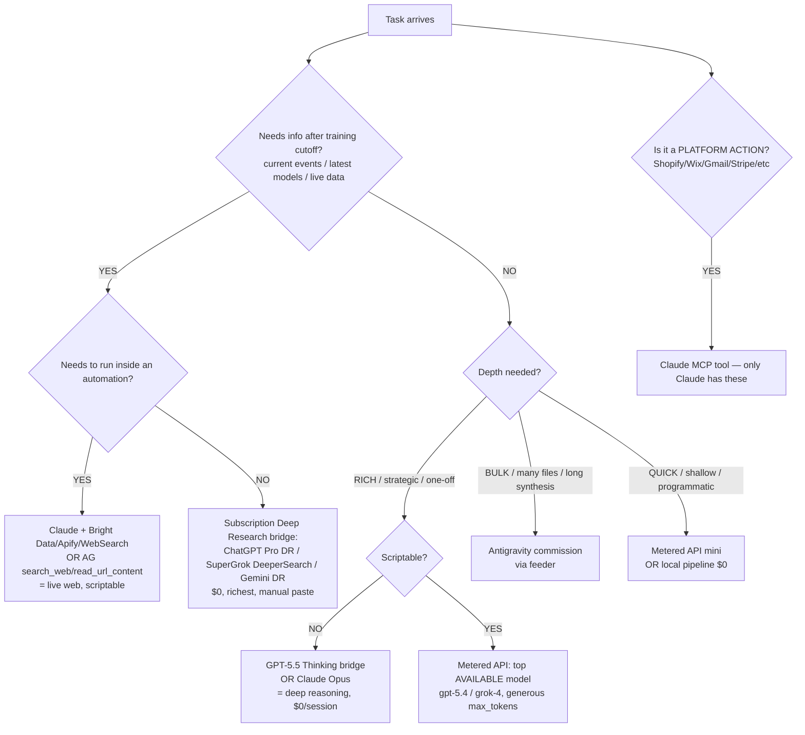

# Hive-Mind Model Routing Engine

**The problem Adrian named (2026-05-29):** the metered base-model API is *limited by its training cutoff* — it can't research, can't see the latest. The subscription models (ChatGPT Pro, SuperGrok, Gemini) are *not* limited — they research live, find the newest case studies, scrape the forums. So we need (1) an explicit map of **which brain for which job**, (2) **how to instruct each** for its talents, and (3) an **auto-refresh loop** that keeps the map current as new models launch and the community discovers new uses.

---

## 1. The core routing axis (the insight)

Every model choice resolves on two axes crossed:

```
                 LIVE / CURRENT  ◄──────────────────────►  TRAINING-FROZEN
                 (can research)                            (knows only ≤ cutoff)
   RICH /  ┌─────────────────────────────┬─────────────────────────────┐
  DEEP     │  ChatGPT Pro Deep Research   │  GPT-5.5 Thinking (web)      │
  (extended│  SuperGrok DeeperSearch      │  Claude Opus (reasoning,     │
  reason)  │  Gemini Deep Research        │   synthesis, voice, memory)  │
           │  Claude + Bright Data/Apify  │                             │
           ├─────────────────────────────┼─────────────────────────────┤
   FAST /  │  (live + shallow:            │  Metered API: gpt-5.4,       │
  CHEAP /  │   WebSearch, AG search_web)  │   grok-4 — programmatic,     │
  PROGRAM. │                             │   one-shot, NO live facts    │
           └─────────────────────────────┴─────────────────────────────┘
```

**The two questions that route 90% of work:**
1. **Does it need information after my training cutoff (current events, latest models, live prices, "what's working now")?** → If yes, you MUST use a live-web tool. No base-model API call, however expensive, can answer it. This was the load-bearing lesson of 2026-05-29.
2. **Does it need to run inside an automation / be called from code?** → If yes, only the metered API or Claude's own tools qualify (the subscription web UIs can't be scripted). Accept the training-cutoff limit, or have the automation hand off to a bridge.

Everything else is depth-vs-cost tuning.

---

## 2. The decision schematic



### The 5-capability Venn (overlay)
Each tool sits in one or more capability circles; pick the tool covering the circles your task needs:

| Capability circle | Who's in it |
|---|---|
| **Live web research** | ChatGPT Pro DR, SuperGrok, Gemini DR, Claude (+Bright Data/Apify/WebSearch), AG (search_web) |
| **Deep reasoning / richness** | GPT-5.5 Thinking, Claude Opus, Gemini, o-series (if on a sub) |
| **Programmatic / automatable** | Metered API (gpt-5.4/grok-4), Claude tools, AG run_command, local scripts |
| **Bulk / scale / long-horizon** | Antigravity, local pipelines (Whisper/ffmpeg) |
| **Platform actions (write to real systems)** | Claude MCPs (Shopify, Wix, Gmail, Stripe, DocuSign, Drive…) |

The richest routing lives in the **overlaps**: e.g. "current + deep + not-scriptable" = ChatGPT Pro Deep Research; "current + scriptable" = Claude+Bright Data; "frozen + deep + scriptable" = metered gpt-5.4.

---

## 3. Per-model talent & instruction profiles

| Model / surface | Talents | When to use | When NOT | How to instruct | Cost |
|---|---|---|---|---|---|
| **ChatGPT Pro — Deep Research** (web, Adrian's sub) | Best live web research; account memory; long structured docs; DALL-E/Sora | "What's working now", market scans, competitor intel, rich strategy needing sources | Anything scriptable; quick lookups | Give a research *brief* + ask for sources + a structured deliverable; turn Deep Research ON; paste the Deposit Footer to bridge it back | $0 (sub) |
| **GPT-5.5 Thinking** (web) | Deepest reasoning; exhaustive structured output; disciplined (won't fabricate when prompted to flag confidence) | Rich strategy/architecture one-offs (proven 2026-05-29 to beat the metered API) | Live facts (still has a cutoff); scripted use | Big open prompt; ask it to flag confident-vs-inferred; no token cap to fight | $0 (sub) |
| **SuperGrok — DeeperSearch** (web) | Real-time X/web; trend scanning; less-moderated; contrarian challenger; Aurora images | Real-time sentiment, what people are saying RIGHT NOW, adversarial stress-test | Polite/measured synthesis; platform actions | Frame as challenger/contrarian; ask for real-time + sources | $0 (sub) |
| **Gemini** (AI Ultra, via AG) | Huge context window; multimodal; Imagen/Veo; deep research | Dump-huge-context tasks; image/video gen; long-doc analysis | Things needing Claude's MCPs | Dump the full context in one shot; exploit the context window | $0 (sub) / paid Veo |
| **Metered API — gpt-5.4 / grok-4** | Fast, cheap, **scriptable** (callable from code/automations), one-shot | Inside automations; quick programmatic reasoning where live facts aren't needed | Anything needing current info (it's frozen); rich strategy (use 5.5 bridge) | Request the top *AVAILABLE* model (5.5 not on key → falls to 4.1!); generous max_tokens to avoid truncation; ONE comprehensive prompt; deploy allocated budget fully | ~$0.01–0.10 |
| **Claude (me)** | Orchestration, synthesis, voice-match, memory, the vault, MCP platform actions, **+ live web via Bright Data/Apify/WebSearch** | Routing, synthesis, writing in Adrian's voice, executing platform actions, holding the whole picture (1M context) | Bulk multi-file burns (→AG); being the sole source on post-cutoff facts (→bridge) | — | session |
| **Antigravity** | Bulk, long-horizon, file-heavy, native shell + internet | Overnight burns, per-file extraction at scale | MCP-dependent or short decisional tasks | Feeder protocol, bounded parcels | $0 (sub) |

---

## 4. The routing rules locked from the 2026-05-29 lessons

1. **Current facts → live-web tool, never a base model.** No metered spend buys post-cutoff knowledge.
2. **Rich strategy one-off → GPT-5.5 Thinking bridge ($0)**, not the metered API. The free 5.5 paste beat the $0.024 metered call.
3. **Scriptable/automated → metered API** (the only one callable in code) — accept the cutoff, or hand off to a bridge for the research leg.
4. **Allocated budget = deploy fully** — generous max_tokens (avoid truncation), top *available* model, chain clarification shots. Under-spending with a thinner answer is the failure. (See [[feedback-prebudgeted-chatgpt-equals-authorisation]].)
5. **Always check the "(fell back to …)" line** — requesting an unprovisioned model silently downgrades (5.5→4.1).
6. **Bulk → AG; platform action → Claude MCP; voice/synthesis → Claude.**

---

## 5. The Model Intelligence Harvester (the auto-refresh loop)

**Purpose:** keep §3 and the capability map current as (a) new models launch and (b) the community discovers innovative uses — so routing decisions never go stale.

### 5.1 Architecture — $0, verified 2026-05-29 (the live-web tools ARE the scraper)

**Source-verification result (2026-05-29):** HN Algolia API works free via curl ✓. **Reddit curl is blocked** (datacenter-IP wall) ✗; **provider release-notes 403 to curl** ✗. Conclusion: don't self-scrape blocked sites — the **subscription Deep Research bridges + WebSearch already crawl them, free.** No paid scraper (Bright Data/Apify) needed for v1. Adrian-decision 2026-05-29: **free build, $0; both scopes (AI models + venture tactics).**

```
  [SCHEDULER]  weekly LaunchAgent/cron + cheap daily launch-sniff   (18 LaunchAgents already prove this works)
        │
        ▼
  [COLLECT — all $0]
     • HN Algolia API (free curl) → tech-launch signal
     • WebSearch / WebFetch (Claude) → release notes, benchmarks, articles (reach what curl can't)
     • The HARVEST AGENT (headless `claude -p` OR an AG commission) runs the standing harvest prompt
     • ChatGPT Pro Deep Research / SuperGrok DeeperSearch = the heavy crawler — they troll
       Reddit / X / forums for free as part of research (this is the scraper, $0)
        │
        ▼
  [SYNTHESIS — $0]  the agent (claude -p / AG / bridge) synthesises raw signal → dated digest + routing-map deltas
        │
        ▼
  [MAP UPDATE]  update §3 + full-stack-capability-map; alert Adrian ONLY when a finding changes a routing call
```

**Both scopes (locked):** the same agent harvests (a) AI-model intelligence AND (b) venture marketing tactics — what's working *now* in Meta ads / SEO / funnels / subscription growth — feeding both the routing map and the venture strategies.

**Paid scraper = deferred escalation only.** If a specific bot-locked source (deep X/LinkedIn) later proves essential beyond what Grok's native live-X gives, add Bright Data/Apify as a deliberate capped decision — not the default.

### 5.2 Sources to troll
- **Reddit:** r/LocalLLaMA, r/OpenAI, r/ClaudeAI, r/Bard (Gemini), r/singularity, r/artificial, r/MachineLearning
- **Hacker News** (model-launch + "Show HN" threads), **latent.space**, **lmarena.ai** (leaderboard shifts)
- **X / Twitter** AI community (via Apify X actor) — real-time launch reactions, innovative-use threads
- **Provider release notes** (OpenAI / Anthropic / Google / xAI), **YouTube** (case-study channels via Apify)
- **AI newsletters** (the high-signal ones)

### 5.3 What it harvests (the "rich feedback + innovative uses")
New releases + version bumps · benchmark/leaderboard shifts · pricing changes · **innovative usage patterns** ("how I use Gemini's 1M context for X", "Grok DeeperSearch beats Y for Z") · case studies + applications · model limits/failure modes · new tool integrations · what people are *excited* about and *why*.

### 5.4 Cadence (recommendation)
**Weekly full harvest + a cheap daily "launch sniff".** Reasoning: the model landscape moves fast but not *daily*-meaningfully; a daily full scrape = noise + cost. So:
- **Daily (cheap):** a single WebSearch/SERP check "any major model launched in the last 24h?" — only escalates to a full harvest on a real hit.
- **Weekly (full):** the scrape→synthesis→digest→map-update cycle.
- **Event-triggered:** on a major launch (GPT-6, Claude 5, Gemini 3.5, etc.) fire the full harvest immediately.

### 5.5 Cost control
Scraping is metered (Bright Data). Cap it: bounded source list, weekly not daily, the daily sniff is a single cheap query. **Synthesis uses the $0 subscription bridge**, not metered API. Set a monthly scrape budget + log it like API spend.

### 5.6 Output
- Living map updates → this doc §3 + the capability map.
- Dated digests → `canonical/concepts/model-intel/YYYY-MM-DD-digest.md`.
- **Routing-change alerts** → surfaced to Adrian only when a finding actually changes a routing decision (e.g. "new model X now beats gpt-5.4 for cheap programmatic reasoning").

---

## 6. The engine (integration vision)

```
   MODEL INTELLIGENCE HARVESTER  ──updates──►  ROUTING ENGINE (this doc §2–§4)
        (freshness layer)                          (decision layer)
                                                        │ routes each job to →
                                                        ▼
   ┌──────────── EXECUTION SURFACES ────────────────────────────────────┐
   │ Subscription bridges (research/depth) · Metered APIs (programmatic) │
   │ Claude MCPs (platform actions) · Antigravity (bulk) · Local ($0)    │
   │ + Meta API, Shopify, Wix, Stripe, Gmail … (the venture systems)     │
   └─────────────────────────────────────────────────────────────────────┘
```

The **harvester** keeps the **router's** table current; the **router** sends each job to the **execution surface** that fits; the **API automations** (the engine's hands) act on the real venture systems (Meta Ads, Shopify, Wix, email…). One coherent engine that uses every model's *full* capability instead of defaulting to whatever's nearest — across OSB, Subconscious Surgery, AGA Bali, Tri Hita WtE, Ashta, Bodhisvara.

---

## 7. Build plan + decisions for Adrian

**Built now (this doc):** the routing engine + harvester design.

**To build (AG-suitable or Claude, on Adrian's go):**
1. `tools/model-intel-harvest.py` — the scrape→synthesise→digest→map-update script.
2. Auth-verify Bright Data + Apify (build step 0 — confirm the scrapers are authenticated).
3. The schedule (weekly LaunchAgent / scheduled-tasks entry + daily launch-sniff).
4. The digest folder + the routing-change alert hook.

**Decisions:**
1. **Cadence** — weekly full + daily sniff + event-triggered (my recommendation), or different?
2. **Scrape budget cap** — what monthly $ ceiling for Bright Data?
3. **Build owner** — AG commission, or Claude builds it directly?
4. **Scope** — AI-model intelligence only, or also harvest Meta/ads/platform best-practice (so the *venture* tactics stay fresh too)?

---

## Revision History
- 2026-05-29 — v1. Routing engine + per-model instruction profiles + Model Intelligence Harvester design. Built on the 2026-05-29 lessons (training-frozen vs live-web; 5.5 bridge > metered API; deploy allocated budget; check fallback). Extends full-stack-capability-map.
